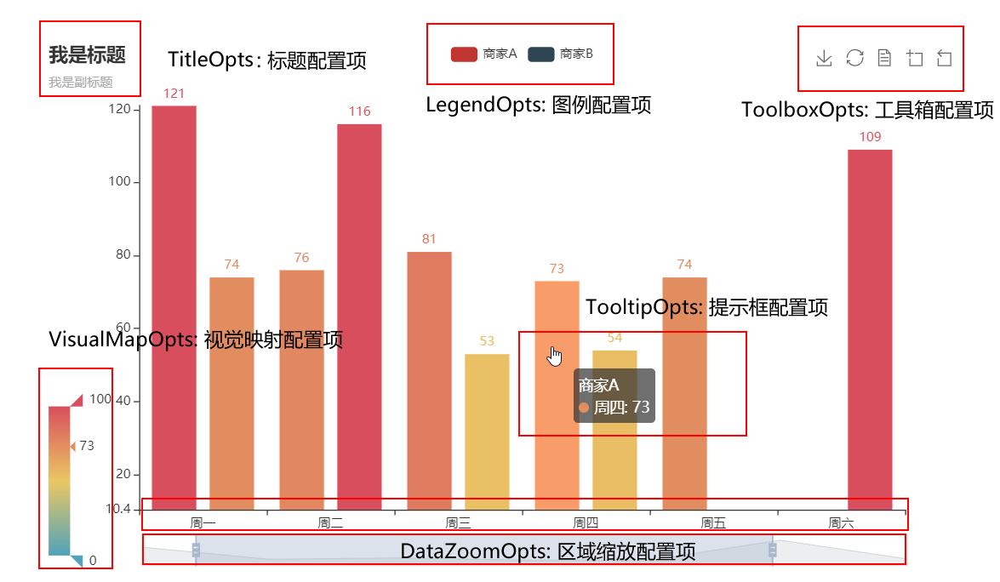
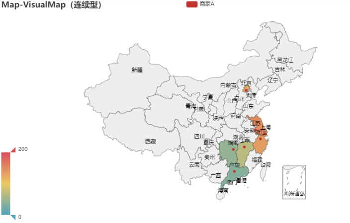
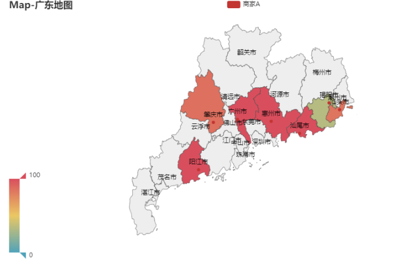
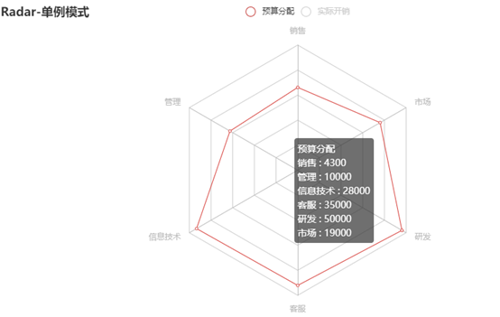
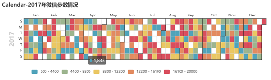
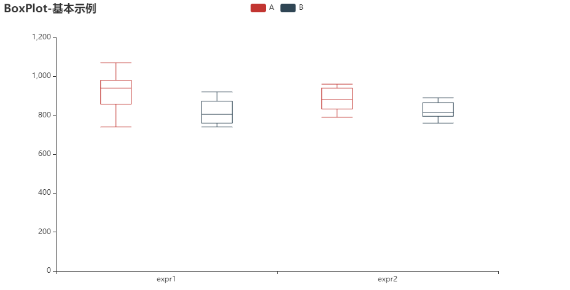

# pyecharts 动态图表
## 1. pyecharts简介
pyecharts是基于百度开源图表组件echarts的python封装。支持所有常用的图表组件，和matlibplot系的图表库不同的是：pyecharts支持动态交互展示，这一点在查看复杂数据图表时特别的有用。

``` shell
pip install pyecharts
```

## 2.pyecharts简单使用
pyecharts支持常用的基本图形展示，条形图、折线图、饼图、散点图、热力图、漏斗图、雷达图、箱型图、地图等，还能支持仪表盘，树形图的展示。
``` python

from pyecharts.charts import Bar,Line
from pyecharts import options as opts
from pyecharts.globals import ThemeType

line = (
    Line(init_opts=opts.InitOpts(theme=ThemeType.LIGHT, width='1000px',height='300px' ))
    .add_xaxis(["衬衫", "羊毛衫", "雪纺衫", "裤子", "高跟鞋", "袜子"])
    .add_yaxis("商家A", [5, 20, 36, 10, 75, 90])
    .add_yaxis("商家B", [15, 6, 45, 20, 35, 66])
    .set_global_opts(title_opts=opts.TitleOpts(title="主标题", subtitle="副标题"),
                        datazoom_opts=opts.DataZoomOpts(is_show=True))
    .set_series_opts(label_opts=opts.LabelOpts(is_show=True))
)
line.render('test.html')
line.render_notebook()
```


从上面简单事例可知，pyecharts的使用包括:
- 图标类型（Line）本身的初始化配置，如主题，大小
- 加载数据：如加载x轴数据，加载y轴数据（可以多个）
- 设置全局配置，如标题，区域缩放datazoom，工具箱等
- 设置系列配置项，如标签，线条，刻度文本展示等
- 图标显示：`render`保存成html文件，如果是jupyter notebook则直接通过`render_notebook`展示在notebook中

## 3.常用配置使用
在pyecharts中，关于图表外观显示等操作都是在相应的option里配置，包括坐标轴，图例，数据标签，网格线，图表样式/颜色，不同系列等等。



- InitOpts： 各个图表类型初始配置
- set_global_opts： 全局外观配置
- set_series_opts： 系列配置

为了方便大家和自己，下面给出一个常用的组合，通常可视化足够用了，快收藏。
- InitOpts：主题，长宽，动画效果
- DataZoomOpts： 区域收缩，这个对于数据特别多，如一天的时间序列数据，特别有用，可以拖动查看全局和局部的数据（可以设置是否显式显式还是可拖动type_="inside"）
- 标题配置TitleOpts： 说明这个图表说明的是什么，必备的吧
- 图例配置LegendOpts：说明图表中的不同数据项（这个图例是可以点击的，可以单独查看某个图例的数据，很有用）
- 提示框配置TooltipOpts：显示图例具体某个点的数据
- x轴和y轴坐标轴标题说明AxisOpts
- 坐标刻度调整： 特别适用于刻度说明比较多，可以显示角度变换等
- markpoint/markline: 对图表的特别标记，用于重点说明部分和标注区分线

``` python
from pyecharts.charts import Bar,Line
from pyecharts import options as opts
from pyecharts.globals import ThemeType

bar = (
    Bar(init_opts=opts.InitOpts(theme=ThemeType.LIGHT, 
                                 width='1000px',
                                 height='300px', 
                                 animation_opts=opts.AnimationOpts(animation_delay=1000, animation_easing="elasticOut")
                                )
        )
    .add_xaxis(["衬衫", "羊毛衫", "雪纺衫", "裤子", "高跟鞋", "袜子"])
    .add_yaxis("商家A", [5, 20, 36, 10, 75, 90])
    .add_yaxis("商家B", [15, 6, 45, 20, 35, 66])
    .set_global_opts(title_opts=opts.TitleOpts(title="主标题", subtitle="副标题"),
                     toolbox_opts=opts.ToolboxOpts(is_show=False),
                     # datazoom_opts=opts.DataZoomOpts(is_show=True)
                     datazoom_opts=[opts.DataZoomOpts(), opts.DataZoomOpts(type_="inside")],
                     legend_opts=opts.LegendOpts(type_="scroll", pos_left="50%", orient="vertical"),
                     xaxis_opts=opts.AxisOpts(axislabel_opts=opts.LabelOpts(rotate=-15), name="我是 X 轴"),
                     yaxis_opts=opts.AxisOpts(name="我是 Y 轴", axislabel_opts=opts.LabelOpts(formatter="{value} /月")),
                     tooltip_opts=opts.TooltipOpts(trigger="axis", axis_pointer_type="cross"),

                    )
    .set_series_opts(label_opts=opts.LabelOpts(is_show=False),
                    markpoint_opts=opts.MarkPointOpts(
                        data=[
                            opts.MarkPointItem(type_="max", name="最大值"),
                            opts.MarkPointItem(type_="min", name="最小值"),
                            opts.MarkPointItem(type_="average", name="平均值"),
                        ]
                        ),
                    )
)
# line.render('test.html')
bar.render_notebook()
```


## 4.常用组合图表使用
常用组合图表有：
- 不同图表类型组合如柱状图和折线图组合在一张图中（双y轴），主要的看同一视角不同指标的差异和关联；pyecharts中是通过overlap实现
    ``` python
    from pyecharts import options as opts
    from pyecharts.charts import Bar, Line
    from pyecharts.faker import Faker

    v1 = [2.0, 4.9, 7.0, 23.2, 25.6, 76.7, 135.6, 162.2, 32.6, 20.0, 6.4, 3.3]
    v2 = [2.6, 5.9, 9.0, 26.4, 28.7, 70.7, 175.6, 182.2, 48.7, 18.8, 6.0, 2.3]
    v3 = [2.0, 2.2, 3.3, 4.5, 6.3, 10.2, 20.3, 23.4, 23.0, 16.5, 12.0, 6.2]


    bar = (
        Bar(init_opts=opts.InitOpts(width="680px", height="300px"))
        .add_xaxis(Faker.months)
        .add_yaxis("蒸发量", v1)
        .add_yaxis("降水量", v2)
        .extend_axis(
            yaxis=opts.AxisOpts(
                axislabel_opts=opts.LabelOpts(formatter="{value} °C"), interval=5
            )
        )
        .set_series_opts(label_opts=opts.LabelOpts(is_show=False))
        .set_global_opts(
            title_opts=opts.TitleOpts(title="Overlap-bar+line"),
            yaxis_opts=opts.AxisOpts(axislabel_opts=opts.LabelOpts(formatter="{value} ml")),
            tooltip_opts=opts.TooltipOpts(trigger="axis", axis_pointer_type="cross"),
        )
    )

    line = Line().add_xaxis(Faker.months).add_yaxis("平均温度", v3, yaxis_index=1)
    bar.overlap(line)
    bar.render_notebook()
    ```
    从实现上，
    - `.extend_axis`增加一个纵坐标
    - 增加的折线图设置轴坐标时设置`yaxis_index`索引和前面的纵坐标对应
    - 然后两张叠加overlap `bar.overlap(line)`

    

- 多图标以网格（GRID）方式组合，主要是对比；pyecharts中是通过grid组件实现
    ``` python
    from pyecharts import options as opts
    from pyecharts.charts import Bar, Grid, Line
    from pyecharts.faker import Faker

    bar = (
        Bar()
        .add_xaxis(Faker.choose())
        .add_yaxis("商家A", Faker.values())
        .add_yaxis("商家B", Faker.values())
        .set_global_opts(title_opts=opts.TitleOpts(title="Grid-Bar"))
    )
    line = (
        Line()
        .add_xaxis(Faker.choose())
        .add_yaxis("商家A", Faker.values())
        .add_yaxis("商家B", Faker.values())
        .set_global_opts(
            title_opts=opts.TitleOpts(title="Grid-Line", pos_top="48%"),
            legend_opts=opts.LegendOpts(pos_top="48%"),
        )
    )

    grid = (
        Grid(init_opts=opts.InitOpts(width="680px", height="500px"))
        .add(bar, grid_opts=opts.GridOpts(pos_bottom="60%"))
        .add(line, grid_opts=opts.GridOpts(pos_top="60%"))
    )
    grid.render_notebook()
    ```
    从实现看
    - 主要通过`Grid`把各种图形放入其中
    - 各个图表的位置通过`GridOpts`来设置，上下左右的位置
    - 需要注意的是:grid中图表的title和图例需要根据所处位置来指定相对的位置（这个有点麻烦，多调调）
    
    

## 5.地图使用
地图可用在展示数据在地理位置上的分布情况，也是很常见的可视化的展示组件。pyecharts中是通过`Map`类来实现的。具体细节需要注意：
- map支持不同的maptype，如中国地图china(省级) china-cities（市级），世界地图world，还有中国各省市地图以及世界各国国家地图，参看github `pyecharts/datasets/map_filename.json`
- map的数据格式是（地理位置， value）， 如`[['广东', 76],['北京', 58]]`
- 可以通过`visualmap_opts`查看着重点

``` python
from pyecharts import options as opts
from pyecharts.charts import Map
from pyecharts.faker import Faker

c1 = (
    Map()
    .add("商家A", [list(z) for z in zip(Faker.guangdong_city, Faker.values())], "广东")
    .set_global_opts(
        title_opts=opts.TitleOpts(title="Map-广东地图"), visualmap_opts=opts.VisualMapOpts()
    )
   
)

c2 = (
    Map()
    .add("商家A", [list(z) for z in zip(Faker.provinces, Faker.values())], "china")
    .set_global_opts(
        title_opts=opts.TitleOpts(title="Map-VisualMap（连续型）"),
        visualmap_opts=opts.VisualMapOpts(max_=200),
    )
)

# c1.render_notebook()
c2.render_notebook()
```



## 6.特色图表使用
在学习pyecharts时，看到一些比较有意思的（动态展示）组件，如随着时间动态展示图表数据的变化。这里做下介绍
- Timeline：时间线轮播多图
    先声明一个`Timeline`, 按照展示的时间顺序，将图表add到`Timeline`上; 可以通过播放按钮循环按照时间顺序展示图表。
    ``` python
    from pyecharts import options as opts
    from pyecharts.charts import Pie, Timeline
    from pyecharts.faker import Faker

    attr = Faker.choose()
    tl = Timeline()
    for i in range(2015, 2020):
        pie = (
            Pie()
            .add(
                "商家A",
                [list(z) for z in zip(attr, Faker.values())],
                rosetype="radius",
                radius=["30%", "55%"],
            )
            .set_global_opts(title_opts=opts.TitleOpts("某商店{}年营业额".format(i)))
        )
        tl.add(pie, "{}年".format(i))
    tl.render_notebook()
    ```
    

- 仪表盘
    ``` python
    from pyecharts import options as opts
    from pyecharts.charts import Gauge

    c = (
        Gauge()
        .add("", [("完成率", 30.6)], radius="70%",
            axisline_opts=opts.AxisLineOpts(
                linestyle_opts=opts.LineStyleOpts(
                    color=[(0.3, "#67e0e3"), (0.7, "#37a2da"), (1, "#fd666d")], width=30)
                ),
                title_label_opts=opts.LabelOpts(
                    font_size=20, color="blue", font_family="Microsoft YaHei"
                ),
            )
        .set_global_opts(title_opts=opts.TitleOpts(title="Gauge-基本示例"), legend_opts=opts.LegendOpts(is_show=False),)
    
    )
    c.render_notebook()
    ```
    


## 7.其他图表一览
从上面的实例看，已经展示地图，条形图，折线图，饼图，仪表盘。这里展示下pyecharts提供的更多的图表，
- 雷达图 Radar



- 树形图 Tree


- 热力图 heatMap


- 日历图 Calendar



- 散点图 Scatter


- 3D图 Bar3D


- 箱型图 Boxplot



## 8.总结
本文介绍的基于echarts的python动态图表展示组件pyecharts，除了提供众多常用的图表外，最重要的是支持动态操作数据。总结如下：
- pyecharts所有的图像属性设置都通过opts来设置，有图表初始属性/全局属性/系列属性
- 本文提供常用的配置，足够用了，拿走不谢，见`常用配置使用`
- pyecharts 支持多图表组合，如折线图和条形图 overlap， 多个图表grid展示
- pyecharts好用的map，可以展示中国省市，世界各国地图，请按照[位置，value]准备数据
- Timeline可以让你的图表按照时间轮播
- 更多图表参见`参考资料`

## 9.参考资料
- https://pyecharts.org/#/zh-cn/quickstart