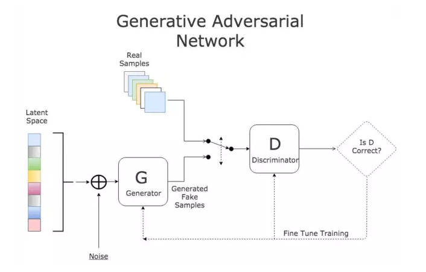
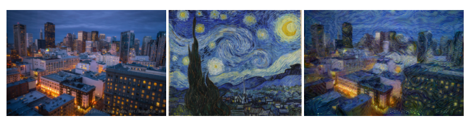
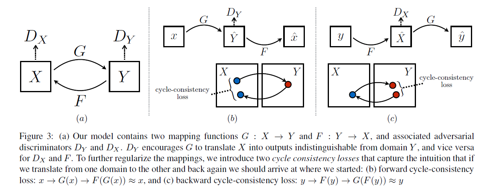
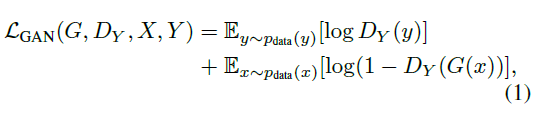
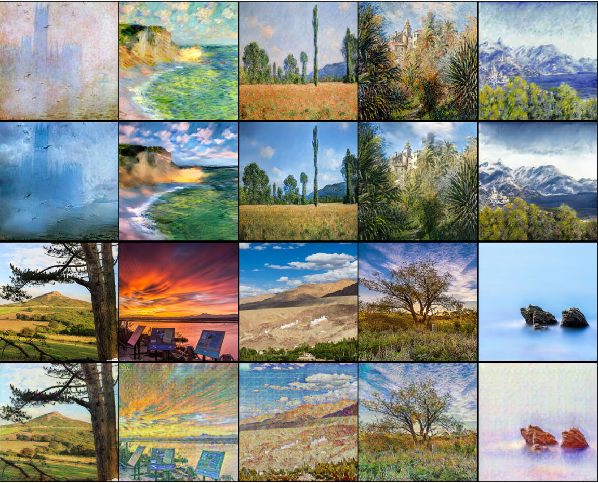
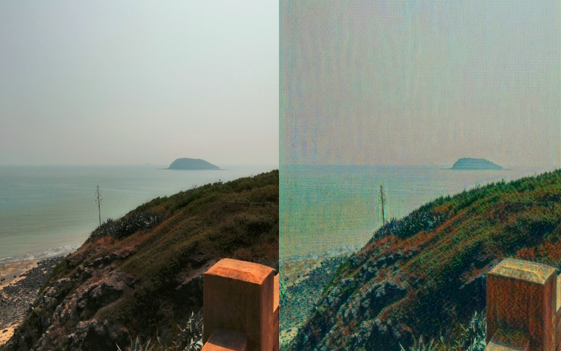
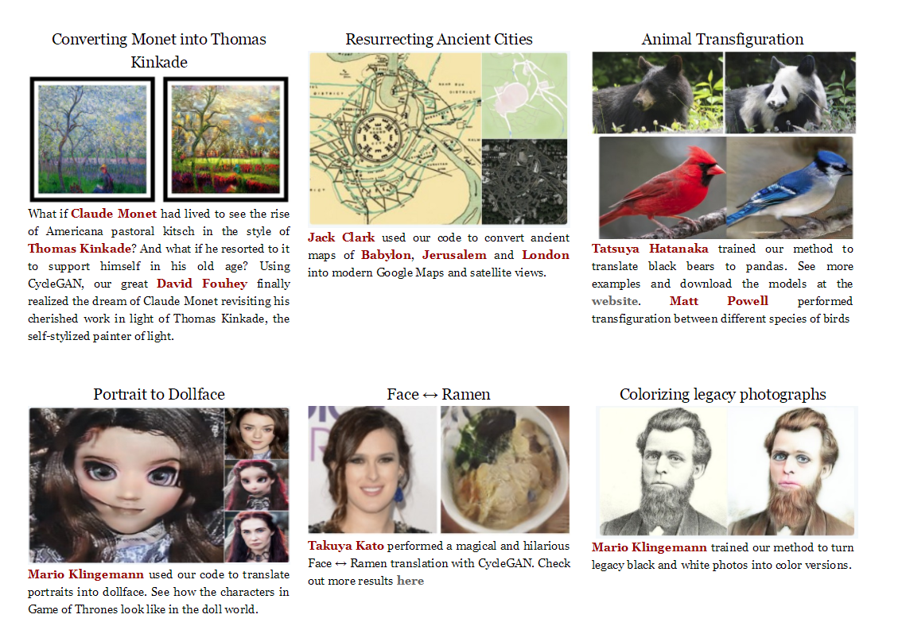

# GAN饭人

## 1. GAN简介
"干饭人，干饭魂，干饭都是人上人"。

此GAN饭人非彼干饭人。 本文要讲的GAN是Goodfellow2014提出的生成产生对抗模型，即Generative Adversarial Nets。那么GAN到底有什么神奇的地方?

常规的深度学习任务如图像分类，目标检测以及语义分割或者实例分割，这些任务的结果都可以归结为预测。图像分类是预测单一的类别，目标检测是预测bbox和类别，语义分割或者实例分割是预测每个像素的类别。而GAN是生成一个新的东西如一个图片。

GAN的原理用一句话来说明：
- 通过对抗的方式，去学习数据分布的生成式模型。GAN是无监督的过程，能够捕捉数据集的分布，以便于可以从随机噪声中生成同样分布的数据

GAN的组成：判别式模型和生成式模型的左右手博弈
- D判别式模型： 学习真假边界，判断数据是真的还是假的
- G生成式模型：学习数据分布并生成数据

    

GAN经典的loss如下（minmax体现的就是对抗）


## 2. 实战cycleGAN 风格转换
了解了GAN的作用，来体验的GAN的神奇效果。这里以cycleGAN为例子来实现图像的风格转换。所谓的风格转换就是改变原始图片的风格，如下图左边是原图，中间是风格图（梵高画），生成后是右边的具有梵高风格的原图，可以看到总体上生成后的图保留大部分原图的内容。



### 2.1 cycleGAN简介
cycleGAN本质上和GAN是一样的，是学习数据集中潜在的数据分布。GAN是从随机噪声生成同分布的图片，cycleGAN是在有意义的图上加上学习到的分布从而生成另一个领域的图。cycleGAN假设image-to-image的两个领域存在的潜在的联系。

众所周知，GAN的映射函数很难保证生成图片的有效性。cycleGAN利用cycle consistency来保证生成的图片与输入图片的结构上一致性。我们看下cycleGAN的结构：



**特点总结如下：**
  - 两路GAN：两个生成器[ G：X->Y , F：Y->X ]  和两个判别器[Dx, Dy], G和Dy目的是生成的对象，Dy（正类是Y领域）无法判别。同理F和Dx也是一样的。
  - cycle consistency： G是生成Y的生成器， F是生成X的生成器，cycle consistency是为了约束G和F生成的对象的范围，  是的G生成的对象通过F生成器能够回到原始的领域如：x->G(x)->F(G(x))=x

**对抗loss如下：**

  - 

  - 

  - 

### 2.2 实现cycleGAN
#### 2.2.1 生成器
从上面简介中生成器有两个生成器，一个是正向，一个是反向的。结构是参考论文`Perceptual Losses for Real-Time Style Transfer and Super-Resolution: Supplementary Material`。大致可以分为：下采样 + residual 残差block + 上采样，如下图（摘自论文）：


实现上下采样是stride=2的卷积， 上采样用nn.Upsample：
``` python
# 残差block
class ResidualBlock(nn.Module):

    def __init__(self, in_features):
        super(ResidualBlock, self).__init__()

        self.block = nn.Sequential(
            nn.ReflectionPad2d(1),
            nn.Conv2d(in_features, in_features, 3),
            nn.InstanceNorm2d(in_features),
            nn.ReLU(inplace=True),
            nn.ReflectionPad2d(1),
            nn.Conv2d(in_features, in_features, 3),
            nn.InstanceNorm2d(in_features),
        )

    def forward(self, x):
        return x + self.block(x)

class GeneratorResNet(nn.Module):
    def __init__(self, input_shape, num_residual_blocks):
        super(GeneratorResNet, self).__init__()

        channels = input_shape[0]

        # Initial convolution block
        out_features = 64
        model = [
            nn.ReflectionPad2d(channels),
            nn.Conv2d(channels, out_features, 7),
            nn.InstanceNorm2d(out_features),
            nn.ReLU(inplace=True),
        ]
        in_features = out_features

        # Downsampling
        for _ in range(2):
            out_features *= 2
            model += [
                nn.Conv2d(in_features, out_features, 3, stride=2, padding=1),
                nn.InstanceNorm2d(out_features),
                nn.ReLU(inplace=True),
            ]
            in_features = out_features

        # Residual blocks
        for _ in range(num_residual_blocks):
            model += [ResidualBlock(out_features)]

        # Upsampling
        for _ in range(2):
            out_features //= 2
            model += [
                nn.Upsample(scale_factor=2),
                nn.Conv2d(in_features, out_features, 3, stride=1, padding=1),
                nn.InstanceNorm2d(out_features),
                nn.ReLU(inplace=True),
            ]
            in_features = out_features

        # Output layer
        model += [nn.ReflectionPad2d(channels), nn.Conv2d(out_features, channels, 7), nn.Tanh()]

        self.model = nn.Sequential(*model)

    def forward(self, x):
        return self.model(x)
```

#### 2.2.2 判别器
传统的GAN 判别器输出的是一个值，判断真假的程度。而patchGAN输出是N*N值，每一个值代表着原始图像上的一定大小的感受野，直观上就是对原图上crop下可重复的一部分区域进行判断真假，可以认为是一个全卷积网络，最早是在pix2pix提出（Image-to-Image Translation with Conditional Adversarial Networks）。好处是参数少，另外一个从局部可以更好的抓取高频信息。
```python
class Discriminator(nn.Module):
    def __init__(self, input_shape):
        super(Discriminator, self).__init__()

        channels, height, width = input_shape

        # Calculate output shape of image discriminator (PatchGAN)
        self.output_shape = (1, height // 2 ** 4, width // 2 ** 4)

        def discriminator_block(in_filters, out_filters, normalize=True):
            """Returns downsampling layers of each discriminator block"""
            layers = [nn.Conv2d(in_filters, out_filters, 4, stride=2, padding=1)]
            if normalize:
                layers.append(nn.InstanceNorm2d(out_filters))
            layers.append(nn.LeakyReLU(0.2, inplace=True))
            return layers

        self.model = nn.Sequential(
            *discriminator_block(channels, 64, normalize=False),
            *discriminator_block(64, 128),
            *discriminator_block(128, 256),
            *discriminator_block(256, 512),
            nn.ZeroPad2d((1, 0, 1, 0)),
            nn.Conv2d(512, 1, 4, padding=1)
        )

    def forward(self, img):
        return self.model(img)
```


#### 2.2.3 训练

**loss和模型初始化**
``` python
# Losses
criterion_GAN = torch.nn.MSELoss()
criterion_cycle = torch.nn.L1Loss()
criterion_identity = torch.nn.L1Loss()

cuda = torch.cuda.is_available()
input_shape = (opt.channels, opt.img_height, opt.img_width)

# Initialize generator and discriminator
G_AB = GeneratorResNet(input_shape, opt.n_residual_blocks)
G_BA = GeneratorResNet(input_shape, opt.n_residual_blocks)
D_A = Discriminator(input_shape)
D_B = Discriminator(input_shape)
```

**优化器和训练策略**
``` python
# Optimizers
optimizer_G = torch.optim.Adam(
    itertools.chain(G_AB.parameters(), G_BA.parameters()), lr=opt.lr, betas=(opt.b1, opt.b2)
)
optimizer_D_A = torch.optim.Adam(D_A.parameters(), lr=opt.lr, betas=(opt.b1, opt.b2))
optimizer_D_B = torch.optim.Adam(D_B.parameters(), lr=opt.lr, betas=(opt.b1, opt.b2))

# Learning rate update schedulers
lr_scheduler_G = torch.optim.lr_scheduler.LambdaLR(
    optimizer_G, lr_lambda=LambdaLR(opt.n_epochs, opt.epoch, opt.decay_epoch).step
)
lr_scheduler_D_A = torch.optim.lr_scheduler.LambdaLR(
    optimizer_D_A, lr_lambda=LambdaLR(opt.n_epochs, opt.epoch, opt.decay_epoch).step
)
lr_scheduler_D_B = torch.optim.lr_scheduler.LambdaLR(
    optimizer_D_B, lr_lambda=LambdaLR(opt.n_epochs, opt.epoch, opt.decay_epoch).step
)
```

**训练迭代**

- 训练数据是成对的数据，但是是非配对的数据，即A和B是没有直接的联系的。A是原图，B是风格图
- 生成器训练 
   - GAN loss：判别器判别A和B生成的两个图fake_A、fake_B与GT的loss
   - Cycle loss：反过来fake_A和fake_B 生成的图与A和B像素上差异
- 判别器训练：
   - loss_real: 判别A/B和GT的MSELoss
   - loss_fake:判别生成的fake_A/fake_B与GT的MSELoss

``` python
for epoch in range(opt.epoch, opt.n_epochs):
    for i, batch in enumerate(dataloader):

        # 数据是成对的数据，但是是非配对的数据，即A和B是没有直接的联系的
        real_A = Variable(batch["A"].type(Tensor))
        real_B = Variable(batch["B"].type(Tensor))

        # Adversarial ground truths
        valid = Variable(Tensor(np.ones((real_A.size(0), *D_A.output_shape))), requires_grad=False)
        fake = Variable(Tensor(np.zeros((real_A.size(0), *D_A.output_shape))), requires_grad=False)

        # ------------------
        #  Train Generators
        # ------------------

        G_AB.train()
        G_BA.train()

        optimizer_G.zero_grad()

        # Identity loss
        loss_id_A = criterion_identity(G_BA(real_A), real_A)
        loss_id_B = criterion_identity(G_AB(real_B), real_B)

        loss_identity = (loss_id_A + loss_id_B) / 2

        # GAN loss
        fake_B = G_AB(real_A)
        loss_GAN_AB = criterion_GAN(D_B(fake_B), valid)
        fake_A = G_BA(real_B)
        loss_GAN_BA = criterion_GAN(D_A(fake_A), valid)

        loss_GAN = (loss_GAN_AB + loss_GAN_BA) / 2

        # Cycle loss
        recov_A = G_BA(fake_B)
        loss_cycle_A = criterion_cycle(recov_A, real_A)
        recov_B = G_AB(fake_A)
        loss_cycle_B = criterion_cycle(recov_B, real_B)

        loss_cycle = (loss_cycle_A + loss_cycle_B) / 2

        # Total loss
        loss_G = loss_GAN + opt.lambda_cyc * loss_cycle + opt.lambda_id * loss_identity

        loss_G.backward()
        optimizer_G.step()

        # -----------------------
        #  Train Discriminator A
        # -----------------------

        optimizer_D_A.zero_grad()

        # Real loss
        loss_real = criterion_GAN(D_A(real_A), valid)
        # Fake loss (on batch of previously generated samples)
        # fake_A_ = fake_A_buffer.push_and_pop(fake_A)
        loss_fake = criterion_GAN(D_A(fake_A_.detach()), fake)
        # Total loss
        loss_D_A = (loss_real + loss_fake) / 2

        loss_D_A.backward()
        optimizer_D_A.step()

        # -----------------------
        #  Train Discriminator B
        # -----------------------

        optimizer_D_B.zero_grad()

        # Real loss
        loss_real = criterion_GAN(D_B(real_B), valid)
        # Fake loss (on batch of previously generated samples)
        # fake_B_ = fake_B_buffer.push_and_pop(fake_B)
        loss_fake = criterion_GAN(D_B(fake_B_.detach()), fake)
        # Total loss
        loss_D_B = (loss_real + loss_fake) / 2

        loss_D_B.backward()
        optimizer_D_B.step()

        loss_D = (loss_D_A + loss_D_B) / 2

        # --------------
        #  Log Progress
        # --------------

        # Determine approximate time left
        batches_done = epoch * len(dataloader) + i
        batches_left = opt.n_epochs * len(dataloader) - batches_done
        time_left = datetime.timedelta(seconds=batches_left * (time.time() - prev_time))
        prev_time = time.time()

    # Update learning rates
    lr_scheduler_G.step()
    lr_scheduler_D_A.step()
    lr_scheduler_D_B.step()
```
更多完整代码详见github:
#### 2.2.4 结果展示
本文训练的是莫奈风格的转变，如下图：第一二行是莫奈风格画转换为普通照片，第三四行为普通照片转换为莫奈风格画


再来看实际手机拍摄图片：


#### 2.2.5 cycleGAN其他用途



## 3. 总结
本文详细介绍了GAN的其中一种应用cycleGAN，并将它应用到图像风格的转换。总结如下：
- GAN是学习数据中分布，并生成同样分布但全新的数据
- CycleGAN是两路GAN：两个生成器和两个判别器；为了保证生成器的生成的图片与输入图存在一定的关系，不是随机生产的图片， 引入cycle consistency，判定A->fake_B->recove_A和A的差异
- 生成器：下采样 + residual 残差block + 上采样
- 判别器: 不是一个图生成一个判定值，而是patchGAN方式，生成很N*N个值，而后取均值