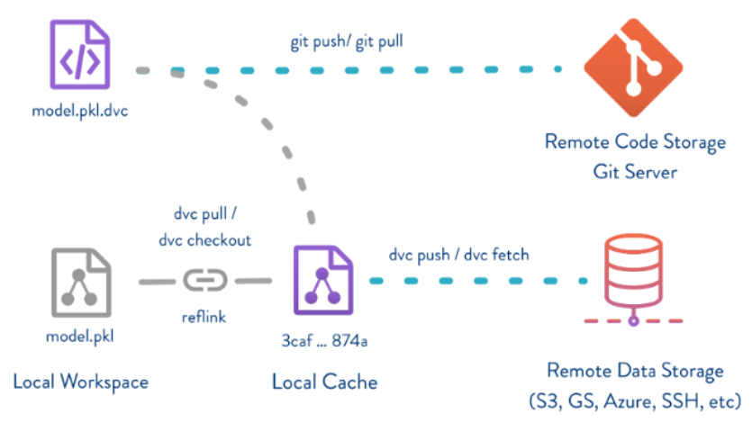

# 人工智能项目的python版本管理工具DVC
个人简介：
wedo实验君, 数据分析师；热爱生活，热爱写作
## 1. 人工智能项目的版本管理
对于传统的软件工程项目(比如java, web), git是一个非常不错的代码版本管理工具。但是人工智能项目，如机器学习或者深度学习，和传统软件工程项目有一定的差别
- 代码和文件：人工智能项目除了代码以外，还要大量的训练数据，还有文件比较大的模型文件
- 开发过程：人工智能项目开发过程，存在一定的不确定性，是一个探索调优的过程。需要很多的组合调参（不同的参数，不同的数据等），然后分别做评估，挑选最好的模型。这是一个相对复杂的过程，要匹配参数，数据，代码，模型。

如上所述，这些差别，git存在一定不足
- git建议的单个文件在50M，并不擅长管理操作大的文件，如几十G的文件
- git因为大数据上管理的不足，就无法管理与之相互关联的一连串的迭代变化

是时候祭出DVC， data version control，数据版本管理工具。

## 2. 什么是DVC


dvc即data version control, 是一种针对人工智能项目（机器学习或者深度学习）的数据版本管理工具。DVC的操作和GIT类似，可以认为为GIT的二次开发封装。结合GIT，DVC可以有效的管理人工智能项目的整个流程，包括代码，数据，训练配置，模型。

GIT和DVC分工如下：
- dvc：负责数据和模型等大文件的存储、下载等管理，同时生成元数据（.dvc文件）描述这些数据和模型， 并且串联整个人工智能项目工作流
- git：负责代码和dvc生成的元数据文件的版本管理

## 3. DVC操作
### 3.1.安装
```bash
pip install dvc
```

### 3.2.数据版本管理
#### 3.2.1 初始化
```bash
# 到git目录下
git config --global user.name "xxxx"
git config --global user.email "xxxx@wedo.com"
git clone ssh://git@101.81.238.21/test/test.git
cd test/

# dvc 初始化
dvc init
# 将dvc 初始化的文件提交 git
git commit -m "Initialize DVC"

# 初始化后会在项目目录下生成.dvc文件夹，存储dvc相关的信息
.dvc
├── config
├── plots
│   ├── confusion.json
│   ├── default.json
│   ├── scatter.json
│   └── smooth.json
└── tmp
    └── index
```
#### 3.2.2 添加数据
可以通过`dvc add/git add`将数据和模型添加到版本管理中
```bash
# 假设数据在arch_train/model_zoo/nsfw_online_err.zip
dvc add arch_train/model_zoo/nsfw_online_err.zip
git add arch_train/model_zoo/.gitignore arch_train/model_zoo/nsfw_online_err.zip.dvc


# .dvc 后缀为数据的元数据文件，默认为存储路径为.dvc/cache下
cat arch_train/model_zoo/nsfw_online_err.zip.dvc
outs:
- md5: 26eb560df48bf11ddf303135749b0c60
  path: nsfw_online_err.zip

.
├── cache
│   └── 26
│       └── eb560df48bf11ddf303135749b0c60
```

#### 3.2.3 版本切换管理
可以配合git的分支管理，来获取分支下不同的数据和模型。
``` bash
# 切换分支
git checkout 分支名

# dvc通过git中的.dvc 文件，切换这个分支下数据
dvc checkout
```

#### 3.2.3 共享代码（push/pull)
当多人开发时，`dvc push`会根据`config`中的远程主机配置，将数据push到远程主机。远程主机可以是ssh，http还有云盘存储等。
```bash
# 建立 远程服务 ssh或者http
# 这里以本地的其他目录为例子
mkdir -p /tmp/dvc-storage
dvc remote add -d myremote /tmp/dvc-storage
git commit .dvc/config -m "Configure local remote"
# 新建后 就会在`.dvc/config`存储远程主机访问的方式
vim config 
[core]
    remote = myremote
['remote "myremote"']
    url = /tmp/dvc-storage

# dvc push 上传数据
dvc push

# 远程主机中数据是上传的一个备份
tree /tmp/dvc-storage/
/tmp/dvc-storage/
└── 26
    └── eb560df48bf11ddf303135749b0c60

1 directory, 1 file
ls -l  /tmp/dvc-storage/26
total 93400
-r--r--r-- 1 root root 95640298 Sep  4 13:44 eb560df48bf11ddf303135749b0c60
ls -lh  /tmp/dvc-storage/26
total 92M
-r--r--r-- 1 root root 92M Sep  4 13:44 eb560df48bf11ddf303135749b0c60

```
如果数据变更，同样dvc+git进行版本管理
```bash
# 数据变化
dvc add arch_train/model_zoo/nsfw_online_err.zip
git commit arch_train/model_zoo/.gitignore arch_train/model_zoo/nsfw_online_err.zip.dvc -m "Dataset updates"
dvc push
```

当其他人想使用共享代码和数据时 `git clone` + `dvc pull`
```bash
# 下载代码和数据.dvc
git clone ssh://git@101.81.238.21/test/test.git
cd test/

# 根据.dvc和config远程主机配置，下载对应的数据和模型
dvc pull 
```


### 3.3 串联工作流
3.2中已经介绍了dvc的最常用的操作，可以看出操作和git的操作基本上吻合的，原理上可以和git对等。
可以通过`dvc run`来建立训练和评估过程的依赖关系，即将输入的数据，预训练的模型，配置和输出的模型和训练脚本关联起来，可以很方面追溯执行过程， 每次关联dvc都会生成一个yaml配置来描述这个关联性。
dvc run的主要参数
- `-n` 操作的名称
- `-p` 配置，可以是多个，文件或者文件夹
- `-d` 操作依赖的数据，脚本和模型等，可以是多个，文件或者文件夹
- `-o` 操作的输出，可以是多个，文件或者文件夹
- command： 执行操作的命令如python -u train.py 

```bash
dvc run -n prepare \
          -p prepare.seed,prepare.split \
          -d src/prepare.py -d data/data.xml \
          -o data/prepared \
          python src/prepare.py data/data.xml
```

## 4. 总结
dvc把数据、模型、算法脚本和Metrics当成一次代码checkout，配合git就可以很方面的管理每一次训练的所有环节，还可以通过`dvc metrics show -T`来比较不同版本的模型性能。更多详细的dvc功能参见`https://dvc.org/doc/start`；欢迎交流讨论。
总结如下
- dvc add/push/pull 管理数据
- dvc run 管理工作流串联
- 建议一个模型迭代一个分支，该分支囊括代码，数据，模型，配置， 模型评估； 可以完美迭代模型优化，而处乱不惊。