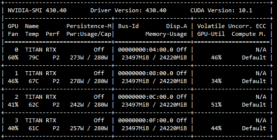

# 提升深度学习训练技巧：GPU利用率和分布式训练Horovod
个人简介：
wedo实验君, 数据分析师；热爱生活，热爱写作
## 1. 训练的瓶颈在哪里
- GPU利用率低：模型训练时GPU显存沾满了，但是GPU的利用率比较不稳定，有时候0%，有时候90%，忽高忽低。

  
- 训练的数据量大：训练数据大，在百万/千万的量级，训练一个Epoch需要很长时间，模型迭代周期过长。

## 2. 提高GPU利用率：CPU vs GPU
GPU利用率低, 主要原因是CPU处理的效率跟不上GPU
### 2.1 CPU vs GPU的通信
- CPU负责加载数据+数据预处理，并不断的在内存和显存之间交互数据 
- GPU负责模型训练（图片来自网络）


### 2.2 解决方案
采用多进程并行处理，加快CPU加载数据的性能
- keras
keras 中提供了`workers` `use_multiprocessing`来采用多进程方式，并行处理数据，并push到队列中，共GPU模型训练。因为进程之间可能相互影响资源，并不是越大越好，workers可以设置2，4，8。
    ```python
    run_model.fit_generator(
                generator=training_generator,
                class_weight={0: config.weights, 1: 1},
                epochs=epochs,
                verbose=1,
                steps_per_epoch=steps_per_epoch,
                callbacks=callbacks_list,
                validation_data=valid_generator,
                validation_steps=validation_steps,
                shuffle=True,
                workers=8,
                use_multiprocessing=True,
                max_queue_size=20
    ```
- pytorch
torch在加载数据中提供类似参数`num_workers`。`pin_memory=True`可以直接加载到显存中，而不需要内存
    ```python
    torch.utils.data.DataLoader(image_datasets[x],
                                batch_size=batch_size, 
                                shuffle=True,
                                num_workers=8,
                                pin_memory=True)
    ```
## 3. 分布式并行训练
### 3.1 并行模式
当训练的数据量很大时，可以通过多个机器多个GPU来提高训练的效率。不同于hadoop和spark等分布式数据处理框架，深度学习训练因为要涉及参数的前项传播和反向传播，有两种并行方式：
- 模型并行（ model parallelism ）:分布式系统中的不同机器（GPU/CPU等）负责网络模型的不同部分，通常是神经网络模型的不同网络层被分配到不同的机器，或者同一层内部的不同参数被分配到不同机器。一般是超大的模型，一张显卡放不下的情况，如NLP的模型。
  模型并行的缺点是层和层之间可能存在依赖关系，不能完全的并行。（图片来自网络）
  


- 数据并行（ data parallelism ）：不同的机器有同一个模型的多个副本，每个机器分配到不同的数据，然后将所有机器的计算结果按照某种方式合并。这种就比较适合大数据的情况。数据并行要解决的问题是数据的分割和传输，以及参数的更新。
  
（图片来自网络）


### 3.2 数据并行
> Facebook在《Accurate, Large Minibatch SGD: Training ImageNet in 1 Hour》介绍了使用 256 块 GPU 进行 ResNet-50 网络「数据并行」训练的方法 
- 数据分割: 选用大的batch-size, 按照worker数量进行分割， 分发到不同worker执行
- 参数更新： 参数的更新有两种模式（1）参数服务器 （2） ring环状更新（无服务器模式）

#### 3.2.1 参数服务器模式
参数服务器模式，见下图。在每个worker执行完一个batch的训练后，反向传播参数的时候，所有的worker都会把参数传给参数服务器，进行汇总求均值，之后再传给每个worker，进入第二个batch的训练。（图片来自网络）


参数服务器有一个或者多个的结构模式，可以看出这种数据并行的模式效率是否提升取决于参数服务器与worker之间的通信效率，也就是最慢的worker的训练时间和参数服务器的接收和更新参数后再回传的时间。worker数量多的话，参数服务器可能存在瓶颈。（图片来自网络）


#### 3.2.2 ring-reduce
百度提出的`ring-reduce`摒弃了参数服务器，采用环状结构来更新参数。ring-reduce把所有的worker组成一个两两相邻的环形结构。每个worker只与相邻的worker交换参数。经过几次交换之后，所有的worker都包含其他worker的参数信息，达到更新的目的。（图片来自网络）


下面几张图，可以看到其中的几个步骤； `ring-reduce`为了加快速度，并不是一次性交换所有的参数；而是先把参数进行分割，不断交换分割后参数。


## 4. 实现框架：Horovod

Horovod 是 Uber 开源的又一个深度学习工具，它的发展吸取了 Facebook「一小时训练 ImageNet 论文」与百度 Ring Allreduce 的优点，可为用户实现分布式训练提供帮助。`https://github.com/horovod/horovod`

采用NCCL 替换百度的 ring-allreduce 实现。NCCL 是英伟达的集合通信库，提供高度优化的 ring-allreduce 版本。NCCL 2 允许在多个机器之间运行 ring-allreduc。

如果要把单机的训练代码修改成分布式的代码，只要几个步骤就可以了
改造分布式训练：
- horovod安装
建议安装docker的horovod，省去安装环境的麻烦。horovod依赖`NCCL 2` `open MPI`
    ```bash
    $ mkdir horovod-docker-gpu
    $ wget -O horovod-docker-gpu/Dockerfile https://raw.githubusercontent.com/horovod/horovod/master/Dockerfile.gpu
    $ docker build -t horovod:latest horovod-docker-gpu
    ```

- 机器worker机器之间ssh打通
- 修改训练代码
  horovod支持tf,keras,pytorch和mxnet等不同的深度学习框架。以keras为例，修改主要6个步骤
  （1） 初始化：hvd.init()
  （2）分配GPU计算资源：`config.gpu_options.visible_device_list = str(hvd.local_rank())`
  （3）分布式的优化器来实现参数的分布式更新：`opt = hvd.DistributedOptimizer(opt)`
  （4）定义所有worker模型初始化一致性 ` hvd.callbacks.BroadcastGlobalVariablesCallback(0)`
  （5）模型保存在某一个worker

    ```python
    from __future__ import print_function
    import keras
    from keras.datasets import mnist
    from keras.models import Sequential
    from keras.layers import Dense, Dropout, Flatten
    from keras.layers import Conv2D, MaxPooling2D
    from keras import backend as K
    import math
    import tensorflow as tf
    import horovod.keras as hvd

    # Horovod: initialize Horovod.
    hvd.init()

    # Horovod: pin GPU to be used to process local rank (one GPU per process)
    config = tf.ConfigProto()
    config.gpu_options.allow_growth = True
    config.gpu_options.visible_device_list = str(hvd.local_rank())
    K.set_session(tf.Session(config=config))

    batch_size = 128
    num_classes = 10

    # Horovod: adjust number of epochs based on number of GPUs.
    epochs = int(math.ceil(12.0 / hvd.size()))

    # Input image dimensions
    img_rows, img_cols = 28, 28

    # The data, shuffled and split between train and test sets
    (x_train, y_train), (x_test, y_test) = mnist.load_data()

    if K.image_data_format() == 'channels_first':
        x_train = x_train.reshape(x_train.shape[0], 1, img_rows, img_cols)
        x_test = x_test.reshape(x_test.shape[0], 1, img_rows, img_cols)
        input_shape = (1, img_rows, img_cols)
    else:
        x_train = x_train.reshape(x_train.shape[0], img_rows, img_cols, 1)
        x_test = x_test.reshape(x_test.shape[0], img_rows, img_cols, 1)
        input_shape = (img_rows, img_cols, 1)

    x_train = x_train.astype('float32')
    x_test = x_test.astype('float32')
    x_train /= 255
    x_test /= 255
    print('x_train shape:', x_train.shape)
    print(x_train.shape[0], 'train samples')
    print(x_test.shape[0], 'test samples')

    # Convert class vectors to binary class matrices
    y_train = keras.utils.to_categorical(y_train, num_classes)
    y_test = keras.utils.to_categorical(y_test, num_classes)

    model = Sequential()
    model.add(Conv2D(32, kernel_size=(3, 3),
                    activation='relu',
                    input_shape=input_shape))
    model.add(Conv2D(64, (3, 3), activation='relu'))
    model.add(MaxPooling2D(pool_size=(2, 2)))
    model.add(Dropout(0.25))
    model.add(Flatten())
    model.add(Dense(128, activation='relu'))
    model.add(Dropout(0.5))
    model.add(Dense(num_classes, activation='softmax'))

    # Horovod: adjust learning rate based on number of GPUs.
    opt = keras.optimizers.Adadelta(1.0 * hvd.size())

    # Horovod: add Horovod Distributed Optimizer.
    opt = hvd.DistributedOptimizer(opt)

    model.compile(loss=keras.losses.categorical_crossentropy,
                optimizer=opt,
                metrics=['accuracy'])

    callbacks = [
        # Horovod: broadcast initial variable states from rank 0 to all other processes.
        # This is necessary to ensure consistent initialization of all workers when
        # training is started with random weights or restored from a checkpoint.
        hvd.callbacks.BroadcastGlobalVariablesCallback(0),
    ]

    # Horovod: save checkpoints only on worker 0 to prevent other workers from corrupting them.
    if hvd.rank() == 0:
        callbacks.append(keras.callbacks.ModelCheckpoint('./checkpoint-{epoch}.h5'))

    model.fit(x_train, y_train,
            batch_size=batch_size,
            callbacks=callbacks,
            epochs=epochs,
            verbose=1,
            validation_data=(x_test, y_test))
    score = model.evaluate(x_test, y_test, verbose=0)
    print('Test loss:', score[0])
    print('Test accuracy:', score[1])
    ```
- 利用horovodrun 执行分布式训练
``` bash
horovodrun -np 16 -H server1:4,server2:4,server3:4,server4:4 python train.py
```

## 5. 总结
本文分享了通过GPU利用率和分布式训练Horovod框架来提升深度学习训练。
- 并行CPU加载数据和预处理，让GPU不再等待CPU
- 采用Horovod让数据并行来提高大数据量的训练的迭代时间


