# python 图像相似性评估

## 1. 图像相似性 
在计算机视觉任务或者图像处理中，常常需要计算图像之间的相似性。特别的，图像相似性经常会用在如图像超分重建，恢复，去噪等任务的质量评估上。

相似性经常通过距离的方式来度量，但图像是高纬度的数据，而且图像相似性判断和人类的主观感受存在一定的关系。本文针对图像相似性，梳理了传统的经典算法和基于感知的深度学习方法，主要方法如下：
- 峰值信噪比 PSNR
- 结构化相似度 SSIM
- 可学习的感知图像相似度 LPIPS

## 2. 方法
### 2.1 PSNR
PSNR全名Peak Signal-to-Noise Ratio 即峰值信噪比，是传统的基于像素级别的图像相似性比较。从下面公式（X和Y是两幅图）可知，PSNR是像素的均方误差后取对数，指标上，PSNR越大越相似。公式中n一般取8，即一副图用8比特表示，即图像的像素值范围为[0-255]。

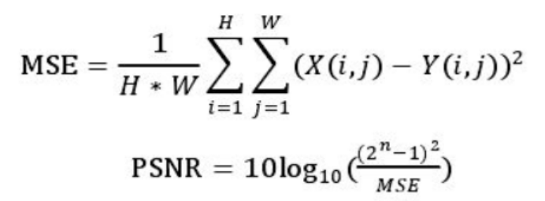

我们来看下PSNR的效果，第一张图为原图，后面依次是扭曲失真，模糊，jpeg压缩，噪声，对比度亮度调整以及饱和度失真：

``` python
from skimage.metrics import structural_similarity as ssim
from skimage.metrics import peak_signal_noise_ratio  as psnr
from imgaug import augmenters as iaa
import numpy as np
import matplotlib.pyplot as plt
import cv2

test_img = cv2.cvtColor(cv2.imread('./cat.png'), cv2.COLOR_BGR2RGB)

blur_aug = iaa.GaussianBlur(sigma=10)
blur_img = blur_aug.augment_image(test_img)

psnr_value = psnr(test_img, blur_img)

```
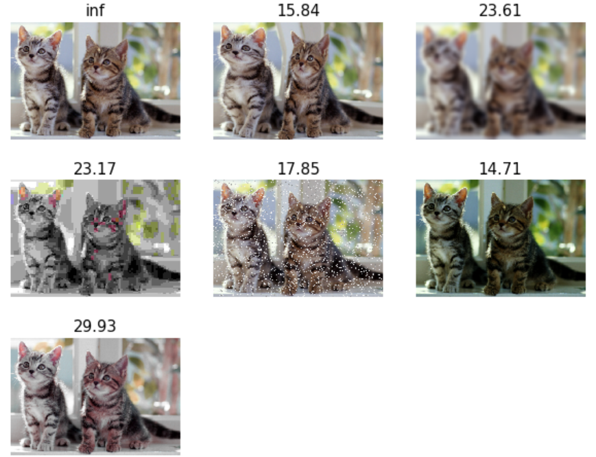

从上图可知，psnr对像素偏差影响较大，对模糊这种人类感知差的反而值越好。

### 2.2 SSIM
PSNR简单粗暴，有计算效率高的特点，但是与人类感知的视觉质量不太匹配。SSIM是2004年Image quality assessment: from error visibility to structural
similarity提出的基于结构化的图像质量评估方法。SSIM从亮度、对比度、结构三个方面度量图像相似性。SSIM取值范围[0, 1]，值越大，表示图像失真越小，越相似。

SSIM的计算过程可以分为三个部分：亮度、对比度、结构。
- 亮度：以灰度值的平均值作为亮度测量
  
  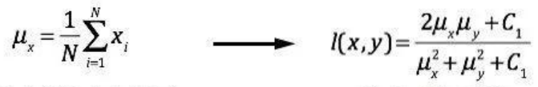

- 对比度：以灰度值的方差作为对比度测量

  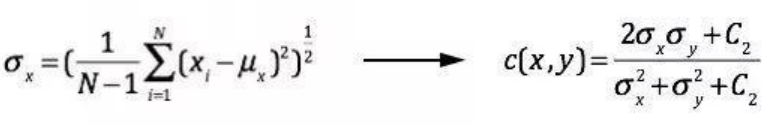

- 结构：以像素值的分布来做结构测量
  
  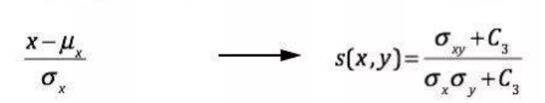

综合ssim值为：
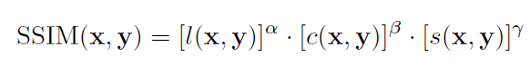

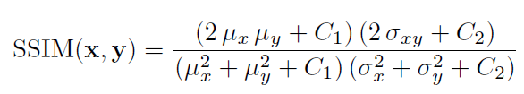

其中C1、C2、C3为常数，避免分母接近于0时造成的不稳定性。

在实现过程中，一张图以小尺寸进行滑窗然后计算ssim后，然后取均值，会比较有效。

我们来看下SSIM的效果，第一张图为原图，后面依次是扭曲失真，模糊，jpeg压缩，噪声，对比度亮度调整以及饱和度失真。
``` python
from skimage.metrics import structural_similarity as ssim
from skimage.metrics import peak_signal_noise_ratio  as psnr
from imgaug import augmenters as iaa
import numpy as np
import matplotlib.pyplot as plt
import cv2

test_img = cv2.cvtColor(cv2.imread('./cat.png'), cv2.COLOR_BGR2RGB)

noise_aug = iaa.AdditiveGaussianNoise(scale=0.2*255)
noise_img = noise_aug.augment_image(test_img)

ssim_value = ssim(test_img, noise_img, multichannel=True)
```

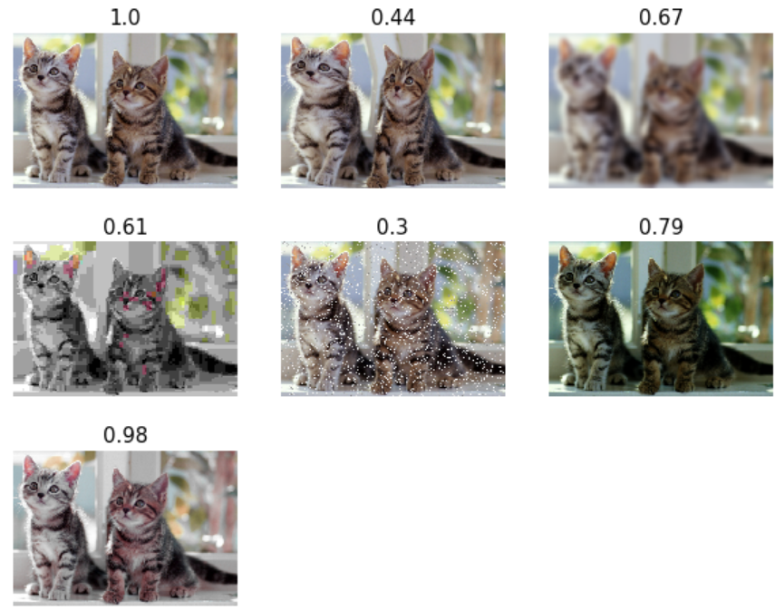

从上图可知，相比psnr， ssmi对于亮度和对比度有一定的鲁棒性，但是相对来说模糊也不能很好的体现人类感知效果。

### 2.3 LPIPS
虽然SSIM也是基于一种感知的度量方法，但是构建人类感知度量是一个挑战，图像相似的感知因素是复杂多变的：结构，上下文等。随着深度学习的发展，由于卷积神经网络高效的提取特征的能力，从语义上评估图像相似性成为可能。The Unreasonable Effectiveness of Deep Features as a Perceptual Metric 这篇文章提出了基于可学习的感知图像相似度量方法LPIPS。

LPIPS通过构建大量的评估图像数据集（Berkeley-Adobe Perceptual Patch Similarity Dataset 简称(BAPPS)）来训练深度的感知度量方法。
 
LPIPS主要的贡献在于如何构建BAPPS，或者说如何获得人类感知的评价, 有了评价值才能训练模型，否则一切免谈。LPIPS首先基于参考图（原图）生成很多失真的图片如模糊，噪声，对比度饱和度变化等，也有基于CNN如去噪，超分，色彩增强等方法生成的图片，在此基础上，基于两种标准找不同人来对参考图和失真进行判断，标准如下：
- 2AFC（two alternative forced choice）：给出两种不同失真操作，挑选出和参考图（原始图）最相近的图，方法中选取了小的区域（64x64）进行判断，有利于局部感知。
- Just noticeable differences (JND)：给出两张图，只判别是否是相同还是不同

数据集构建完成之后，就要搭建可训练的网络。已知x是参考图，x0，x1是失真操作之后的图，由下图可知：
- 计算x和x0的感知距离d0（同理x和x1距离为d1）：先通过特征提取网络F（可以是VGG，AlexNet，SqueezeNet），提取x和x0的各层特征，并作差值，然后乘以一个可学习的权重w，最后进行全局平均得到d0
  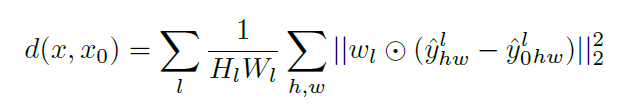
- 训练一个简单的网络来拟合两种判断d0和d1，与人为判断标准h（即gt）

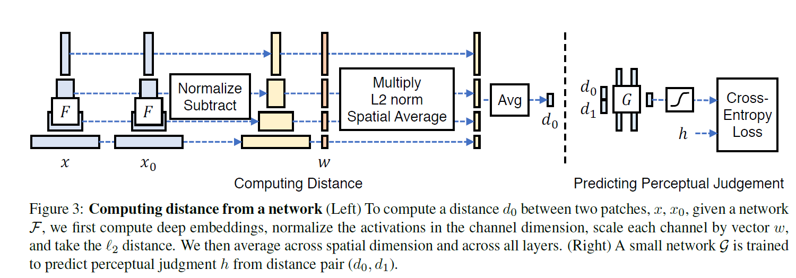

注意的是，w和简单网络G都是训练学习的，特征提取网络F可根据预训练网络固定，也可微调学习

官方github（https://www.github.com/richzhang/PerceptualSimilarity） 提供了可直接使用的预训练模型，我们来试下对比效果 lpips值越小越好，0表示完全一致。 第一张图为原图，后面依次是扭曲失真，模糊，jpeg压缩，噪声，对比度亮度调整以及饱和度失真。

``` shell
pip install lpips
```

``` python
import lpips

loss_fn = lpips.LPIPS(net='alex',version='0.1')
use_gpu = True
path0 = './cat.png'
path1 = './noise_cat.png'
if(use_gpu):
	loss_fn.cuda()

# Load images
img0 = lpips.im2tensor(lpips.load_image(path0)) # RGB image from [-1,1]
img1 = lpips.im2tensor(lpips.load_image(path1))

if(use_gpu):
	img0 = img0.cuda()
	img1 = img1.cuda()

# Compute distance
lpips_value = loss_fn.forward(img0, img1)
```

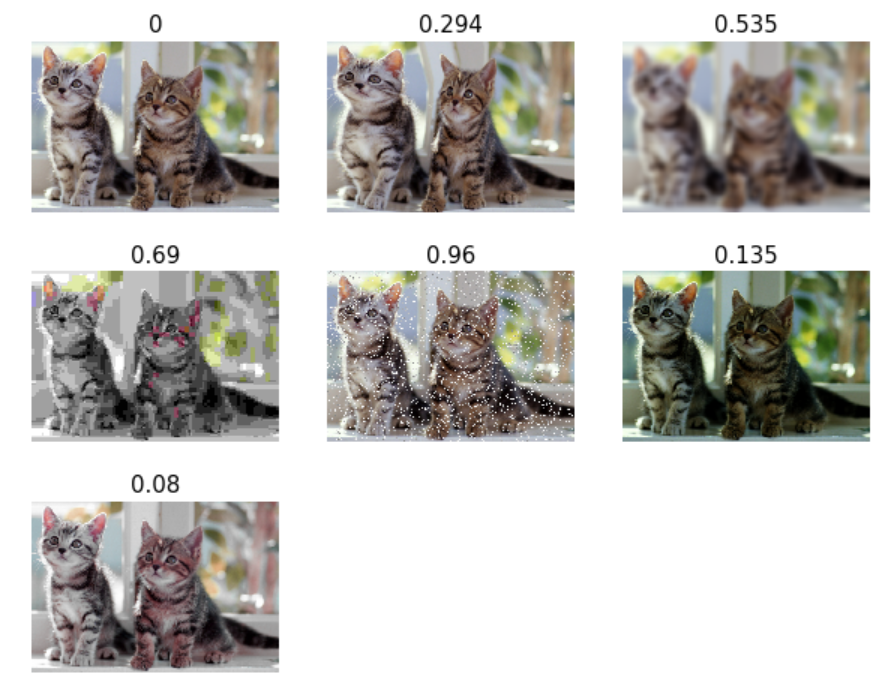


从lpips的值可知，相对细微的扭曲（2），亮度（6）和对比度（7）都符合人体感知，模糊也处理可接受的范围。

## 3. 总结

本文分享了图像相似性评估中三种不同但常用的原理和具体使用，希望对你有帮助，欢迎交流（weixin：@mintel）。总结如下：
- PSNR峰值信噪比：简单速度快，最常见的方式，但与人类感知存在差距，越大越好
- SSIM：亮度、对比度、结构的感知，越大越好
- LPIPS：基于深度学习的感知相似性评估，重在基于2AFC和JND的训练数据构建，和常规网络模型，符合人类感知，越小越好