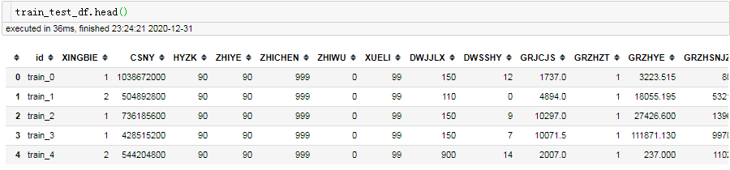
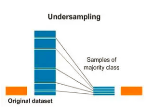
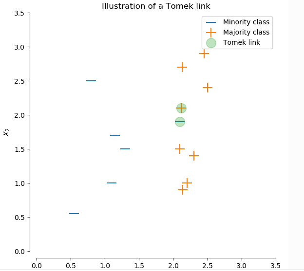
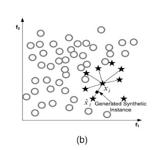
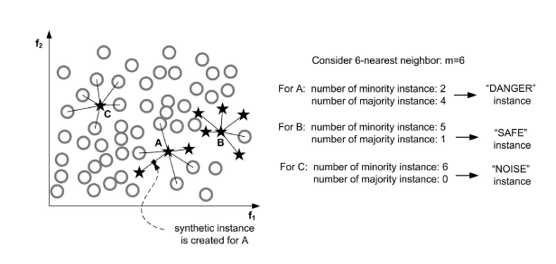
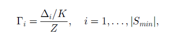
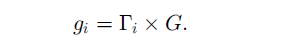

# python处理不平衡数据集

## 1. 什么是数据不平衡
所谓的数据不平衡（imbalanced data）是指数据集中各个类别的数量分布不均衡； 不平衡数据在现实任务中十分的常见。如
- 信用卡欺诈数据：99%都是正常的数据， 1%是欺诈数据
- 贷款逾期数据

不平衡数据一般是由于数据产生的原因导致的，类别少的样本通常是发生的频率低，需要很长的周期进行采集。

在机器学习任务（如分类问题)中，不平衡数据会导致训练的模型预测的结果会偏向于样本数量多的类别，这个时候除了要选择合适的评估指标外，想要提升模型的性能，就要对数据和模型做一些预处理。

处理数据不平衡的主要方法：
- 欠采样
- 过采样
- 综合采样
- 模型集成
- 调整类别权重或者样本权重

## 2. 数据不平衡处理方法
imbalanced-learn库提供了许多不平衡数据处理的方法，本文的例子都以`imbalanced-learn`库来实现。

``` shell
pip install -U imbalanced-learn 
```

> https://github.com/scikit-learn-contrib/imbalanced-learn

本文例子的数据来自进行中的比赛`山东省第二届数据应用创新创业大赛-日照分赛场-公积金贷款逾期预测`

先来看下数据
``` python
import pandas as pd
train_data = './data/train.csv'
test_data = './data/test.csv'
train_df = pd.read_csv(train_data)
test_df = pd.read_csv(test_data)

print(train_df.groupby(['label']).size())
# label为是否违约， 1为违约， 0为非违约
#     label
# 0    37243
# 1     2757
```




### 2.1 欠采样
所谓欠采样，就是将数量多类别（记为majority）的样本进行抽样，使之数量与数量少的类别（minority）的数量相当，以此达到数量的平衡。



由于欠采样是丢失了一部分数据，不可避免的使得数量多类别样本的分布发生了变化（方差变大）。好的欠采样策略应该尽可能保持原有数据分布。

欠采样是删除majority的样本，那哪些样本可以删除呢？ 
- 一种是overlapping的数据，就是多余的数据
- 一种是干扰的数据，干扰minority的分布

基于此，有两种思路来欠采样
- 边界相邻匹配，考虑在近邻空间内删除majority样本，方法如`TomekLinks`, `NearMiss`
    
    下面这张图，展示6NN（6个最近邻居）

    

    这里重点讲下TomekLinks， TomekLinks方法简单的说：对每一个minority样本找1NN（最近的邻居），如果最近的邻居是majority， 就形成一个tome-links，该方法人为这个majority是干扰的，将它删除。

    

    ``` python
    from imblearn.under_sampling import TomekLinks

    X_train = train_df.drop(['id', 'type'], axis=1)
    y = train_df['label']
    tl = TomekLinks()
    X_us, y_us = tl.fit_sample(X_train, y)
    print(X_us.groupby(['label']).size())
    # label
    # 0    36069
    # 1     2757

    ```
    从上可知， 有1174个tomek-link被删除，好像删除还不够多，可以测试下是否对分类结果有帮助。需要注意的因为需要计算最近邻，所以样本属性必须数值属性，或者可以转化为数值属性。

- 聚类
  
    这类方法通过多个聚类，把原始样本划分成多个聚类簇，然后用每个聚类簇的中心来代替这个聚类簇的特性，完成采样的目的。可知，这种采样的样本不是来自原始样本集，而是聚类生成的。
    ``` python
    from imblearn.under_sampling import ClusterCentroids 

    cc = ClusterCentroids(random_state=42)
    X_res, y_res = cc.fit_resample(X_train, y)
    X_res.groupby(['label']).size()
    # label
    # 0    2757
    # 1    2757
    ```

im-balance提供的欠采样的方法如下：
- Random majority under-sampling with replacement
- Extraction of majority-minority Tomek links
- Under-sampling with Cluster Centroids
- NearMiss-(1 & 2 & 3)
- Condensed Nearest Neighbour
- One-Sided Selection
- Neighboorhood Cleaning Rule
- Edited Nearest Neighbours
- Instance Hardness Threshold
- Repeated Edited Nearest Neighbours
- AllKNN

### 2.2 过采样
所谓过采样，就是将数量少的类别（minority）的样本进行copy，使之数量与数量多的类别(majortity)的数量相当，以此达到数量的平衡。由于复制了多份minoruty样本，过采样会改变minority方差。


过采样一种简单的方式是随机copy minority的样本；另外一种是根据现有样本生成人造样本。这里介绍人造样本的经典算法SMOTE(Synthetic Minority Over-sampling Technique)。

SMOTE基于minority样本相似的特征空间构造新的人工样本。步骤如下：
- 选择一个minority样本，计算其KNN邻居
- 在K个邻居中，随机选择一个近邻
- 修改某一个特征,偏移一定的大小：偏移的大小为该minority样本与该近邻差距乘以一个小的随机比率(0, 1)， 就此生成新样本





```python
from imblearn.over_sampling import SMOTE
smote = SMOTE(k_neighbors=5, random_state=42)
X_res, y_res = smote.fit_resample(X_train, y)
X_res.groupby(['label']).size()
# label
# 0    37243
# 1    37243
```

对于SMOTE方法，对每一个minority都会构造新样本。但是并不总是这样的，考虑下面A,B,C三个点。从数据分布来看，C点很可能是一个异常点（Noise），B点是正常分布的点（SAFE），而A点分布在边界位置（DANGER）;

直观上，对于C点我们不应该去构造新样本，对B点，构造新样本不会丰富minority类别的分布。只有A点，如果构造新样本能够使得A点从（DANGER）到（SAFE），加强minority类别的分类边界。这个就是`Borderline-SMOTE`



``` python
from imblearn.over_sampling import BorderlineSMOTE
bsmote = BorderlineSMOTE(k_neighbors=5, random_state=42)
X_res, y_res = bsmote.fit_resample(X_train, y)
X_res.groupby(['label']).size()
# label
# 0    37243
# 1    37243
```

ADASYN方法从保持样本分布的角度来确定生成数据，生成数据的方式和SMOTE是一样的，不同在于每个minortiy样本生成样本的数量不同。
- 先确定要生成样本的数量 beta为[0, 1]

    

- 对每个每个minortiy样本，确定有它生成样本的比例。先找出K最近邻，计算K最近邻中属于majority的样本比例（即分子），Z是归一化因子，保证所有的minortiry的比例和为1，可以认为是所有分子的和。

    

- 计算每个minortiy生成新样本的数量



- 按照SMOTE方式生成样本

``` python
from imblearn.over_sampling import ADASYN 
adasyn = ADASYN(n_neighbors=5, random_state=42)
X_res, y_res = adasyn.fit_resample(X_train, y)
X_res.groupby(['label']).size()

# label
# 0    37243
# 1    36690
```

im-balance提供的过采样的方法如下（包括SMOTE算法的变种）：
- Random minority over-sampling with replacement
- SMOTE - Synthetic Minority Over-sampling Technique 
- SMOTENC - SMOTE for Nominal Continuous
- bSMOTE(1 & 2) - Borderline SMOTE of types 1 and 2
- SVM SMOTE - Support Vectors SMOTE
- ADASYN - Adaptive synthetic sampling approach for imbalanced learning
- KMeans-SMOTE
- ROSE - Random OverSampling Examples

### 2.3 综合采样
过采样是针对minority样本，欠采样是针对majority样本；而综合采样是既对minority样本，又对majority样本，同时进行操作的方法。主要有SMOTE+Tomek-links和SMOTE+Edited Nearest Neighbours。

综合采样的方法，是先进行过采样，在进行欠采样。

``` python
from imblearn.combine import SMOTETomek

smote_tomek = SMOTETomek(random_state=0)
X_res, y_res = smote_tomek.fit_sample(X_train, y)
X_res.groupby(['label']).size()
# label
# 0    36260
# 1    36260
```

### 2.4 模型集成
这里的模型集成主要体现在数据上，即用众多平衡的数据集（majortiry的样本进行欠采样加上minority样本）训练多个模型，然后进行集成。`imblearn.ensemble`提供几种常见的模型集成算法，如`BalancedRandomForestClassifier`

``` python
from imblearn.ensemble import BalancedRandomForestClassifier
from sklearn.datasets import make_classification

X, y = make_classification(n_samples=1000, n_classes=3,
                           n_informative=4, weights=[0.2, 0.3, 0.5],
                           random_state=0)
clf = BalancedRandomForestClassifier(max_depth=2, random_state=0)
clf.fit(X, y)  

print(clf.feature_importances_)  
print(clf.predict([[0, 0, 0, 0, 0, 0, 0, 0, 0, 0,
                    0, 0, 0, 0, 0, 0, 0, 0, 0, 0]]))
```

im-balance提供的模型集成的方法如下
- Easy Ensemble classifier
- Balanced Random Forest
- Balanced Bagging
- RUSBoost

### 2.5 调整类别权重或者样本权重
对于很多用梯度下降方法来学习（使得某个损失Loss最小）的机器学习的方法，可以通过调整类别权重或样本权重的方式，来一定程度上平衡不平衡数据。如gbdt模型`lightgbm` 中 `class_weight`

``` python
import lightgbm as lgb
clf = lgb.LGBMRegressor(num_leaves=31, 
                        min_child_samples= np.random.randint(20,25),
                        max_depth=25,
                        learning_rate=0.1, 
                        class_weight={0:1, 1:10},
                        n_estimators=500, 
                        n_jobs=30)
```

## 3. 总结
本文分享了常见的几种处理不平衡数据集的方法，并且提供`imbalanced-learn`的简单例子。总结如下：

- 欠采样: 减少majoritry样本
- 过采样：增加minority样本
- 综合采样： 先过采样，在欠采样
- 模型集成：制造平衡数据（majoritry样本欠采样+minority样本），多次不同的欠采样，训练不同的模型，然后融合
- 不管是欠采样和过采样，都一定程度的改变了原始数据的分布，可能造成模型过拟合。需要去尝试哪种方法，符合实际的数据分布。当然不一定有效果，去勇敢尝试吧 just do it！

## 4. 参考资料
- Learning from Imbalanced Data
- Two Modifications of CNN（Tomek links，CNN乍一看还以为卷积神经网络，其实是condensed nearest-neighbor）
- imbalanced-learn API： https://imbalanced-learn.org/stable/