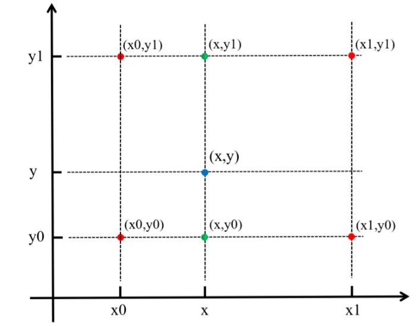

# python 插值算法

## 1. 什么是插值

最近在做时间序列预测时，在突增或者突降的变化剧烈的情况下，拟合参数的效果不好，有用到插值的算法补全一些数据来平滑剧烈变化过程。还有在图像处理中，也经常有用到插值算法来改变图像的大小，在图像超分（Image Super-Resolution）中上采样也有插值的身影。

插值（interpolation），顾名思义就是插入一些新的数据，当然这些值是根据已有数据生成。插值算法有很多经典算法， 本文分享如下：
- 线性插值
- 双线性插值
- 双三次插值bicubic interpolation

## 2. 插值算法原理和实现
### 2.1 线性插值
线性插值是最简单的插值算法。如下图已知(x0, y0) (x1, y1)，在x处插值一点(x, y)。


可以通过简单几何知识来推出公式


实现上直接套公式，如果想插值多个点，可以利用线性回归的方式。

``` python
import os
import numpy as np
from sklearn.linear_model import LinearRegression

def linear_interpolation(data, inter_num=4):
    clf = LinearRegression()
    X = np.array([[1], [inter_num+2]])
    y = data
    clf.fit(X, y)
    inter_values = clf.predict(np.array([ [i+2] for i in range(inter_num)]))
    return inter_values
data = [[10], [20]]
linear_interpolation(data, 1)
# array([[15.]])

def manual_linear_interpolation(x0, y0, x1, y1, x):
    return y0+(x-x0)*(y1-y0)/(x1-x0)
manual_linear_interpolation(1, 10, 3, 20, 2)
# 15.0
```
线性插值算法经常用在平滑数据上，也用在缺失值预处理中。

### 2.2 双线性插值
双线性插值是在两个方向上同时进行线性插值，经常用在图像处理中。双线性插值是已知2*2个点，插值生成一个点的过程。

如下图所示，双线性插值已知(x0, y1)(x0, y0)(x1, y1)(x1, y0)4个点，插值计算(x, y)。
- 先插值生成(x, y1)(x, y0)
  
  

- 在插值生成(x, y)

    



``` python
import cv2
lean_img = cv2.imread('./lena.jpg')
lena_x2 = cv2.resize(lean_img, (0, 0), fx=2, fy=2, interpolation=cv2.INTER_LINEAR)
```


### 2.3 双三次插值
双线性插值利用2*2个点插值生成一个新的点，而双三次插值利用4*4个点来插值一个新的点。插值的过程就是如何估计aij， aij可以认为是16个点对插值点的影响因子。


影响因子设计来自于Cubic Convolution Interpolation For Digital Image Processing，

以下为Bicubic函数


``` python
import cv2
lean_img = cv2.imread('./lena.jpg')
lena_x2_cubic = cv2.resize(lean_img, (0, 0), fx=2, fy=2, interpolation=cv2.INTER_CUBIC)
```

左边为双线性插值，右边有双三次插值，可以看出双三次插值效果好，双线性插值更平滑一点，清晰度不足。


## 3. 总结
本文介绍了三种常见的插值算法以及在数字图像处理中的应用。总结如下：
- 线性插值：通过2点插值新的点，可以利用线性回归计算插值点
- 双线性插值：通过4个点插值新的点
- 双三次插值：通过16个点插值新的点，插值权重利用bicubic函数
