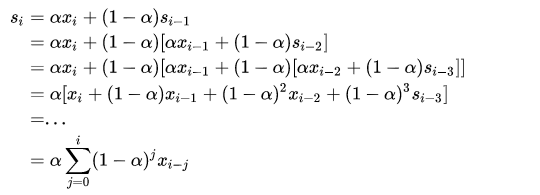
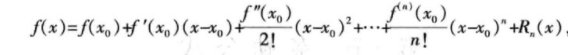
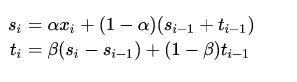
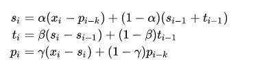
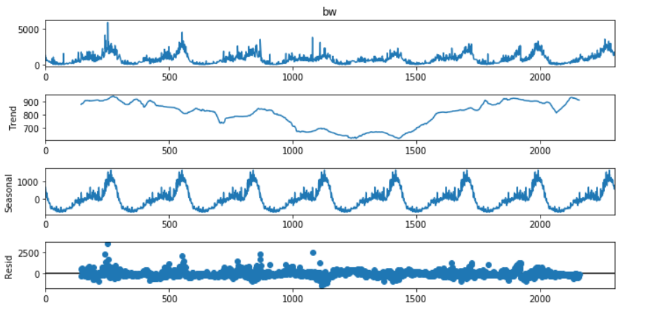
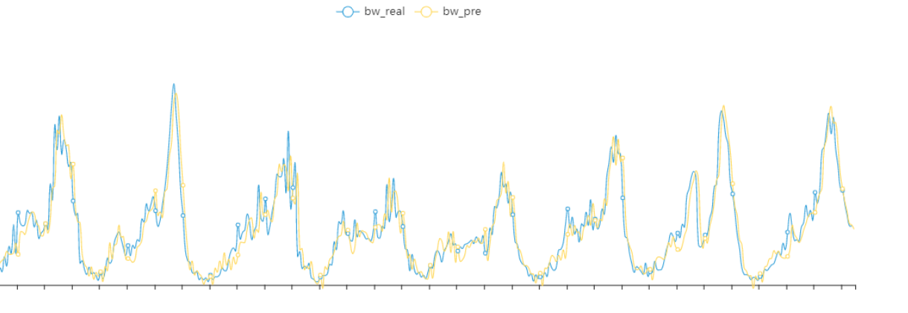

# python时间序列预测之Holt-Winters

## 1. 什么是Holt-Winters
时间序列是非常常见的数据格式，以[时间，观测值]形式表现，如下图。


现实场景中如股票走势图，国家GDP历年数据，机器cpu利用率，内存数据等都是时间序列。对未来时间的观测值进行预测是有意义的工作，提前预知未来的数据的走势，可以提前做出行动，如预测cpu使用率，如果cpu飙高，可以及早进行调整，避免机器负载过高而宕机，这个在AIOPS是很常见的一个应用场景。

今天要说到`Holt-Winters`是利用三次指数平滑来做时间序列预测的方法。`Holt-Winters`综合了1957年Holt和1960年Winters两个人的思路的一种方法。

- **一次指数平滑**

    我们来看下，一次指数平滑如下图：

    

    可知，si表示第i时刻的平滑估计，si可以表示为当前实际值xi和上一时刻平滑估计值得加权组合，权重由alpha来决定。那为什么称为指数平滑呢？我们来把式子展开，如下：

    

    有点类似泰勒展开式的味道

    

    alpha 属于[0, 1], 越大表示近期的数据影响更大

- **二次指数平滑**：加上趋势的因素
  
  一次指数平滑，没有考虑时间序列的趋势和季节性，二次指数平滑加上趋势因素。

    

    从公式可知，一个时间序列的时刻值分解为baseline部分和趋势部分，t表示趋势，可以表示为连续两个时刻的差值；可知，ti也是一次的指数平滑。


- **`Holt-Winters`三次指数平滑**： 加上季节性因素
    
    在二次指数平滑基础上，考虑季节性因素，就是三次指数平滑，也就是Holt-Winters。

    由此，一个时间序列的时刻值分解为baseline部分和趋势部分以及季节部分。由于季节性，存在周期，比如按周，按月等。pi季节性为当前季节性值和上一个周期季节性估计值的加权组合，周期在公式中以k来表示。如下：

    


## 2. Holt-Winters的实现
从第一部分可知，要实现Holt-Winters，只要知道：
- 初始值：s0，t0和p0
- 合适的参数：alpha，beta， gamma
- 套入公式即可完成预测

三个重要参数：alpha，beta， gamma都属于[0, 1]之间，要么人为的搜索，要么通过数据来估计，通常采用L-BFGS优化算法来拟合数据。优化算法来自包`scipy.optimize`的`fmin_l_bfgs_b`。


``` python
from __future__ import division
from sys import exit
from math import sqrt
from numpy import array
from scipy.optimize import fmin_l_bfgs_b

# 优化算法的loss function，即判断拟合效果，由RMSE MAE等
def RMSE(params, *args):

    Y = args[0]
    type = args[1]
    rmse = 0

    alpha, beta, gamma = params
    m = args[2]     
    a = [sum(Y[0:m]) / float(m)]
    b = [(sum(Y[m:2 * m]) - sum(Y[0:m])) / m ** 2]

    if type == 'additive':
        s = [Y[i] - a[0] for i in range(m)]
        y = [a[0] + b[0] + s[0]]

        for i in range(len(Y)):
            a.append(alpha * (Y[i] - s[i]) + (1 - alpha) * (a[i] + b[i]))
            b.append(beta * (a[i + 1] - a[i]) + (1 - beta) * b[i])
            s.append(gamma * (Y[i] - a[i] - b[i]) + (1 - gamma) * s[i])
            y.append(a[i + 1] + b[i + 1] + s[i + 1])

    rmse = sqrt(sum([(m - n) ** 2 for m, n in zip(Y, y[:-1])]) / len(Y))

    return rmse

# 加性的时间序列
def additive(x, m, fc, alpha = None, beta = None, gamma = None):

    Y = x[:]

    # 利用fmin_l_bfgs_b来估计参数alpha beta和gamma
    if (alpha == None or beta == None or gamma == None):

        initial_values = array([0.3, 0.1, 0.1])
        boundaries = [(0, 1), (0, 1), (0, 1)]
        type = 'additive'

        parameters = fmin_l_bfgs_b(RMSE, x0 = initial_values, args = (Y, type, m), bounds = boundaries, approx_grad = True)
        alpha, beta, gamma = parameters[0]

    # 初始值 a表示baseline， b表示趋势，s表示季节性，y表示预测值， 分别取第一个周期的统计数据为初始值
    a = [sum(Y[0:m]) / float(m)]
    b = [(sum(Y[m:2 * m]) - sum(Y[0:m])) / m ** 2]
    s = [Y[i] - a[0] for i in range(m)]
    y = [a[0] + b[0] + s[0]]
    rmse = 0

    # 套用上面公式，从0开始，fc表示预测的数量，如已知前7天，预测接下来的一个小时的数据，如果数据粒度是5分钟，fc为12。
    for i in range(len(Y) + fc):

        if i == len(Y):
            # 预测值为
            Y.append(a[-1] + b[-1] + s[-m])

        a.append(alpha * (Y[i] - s[i]) + (1 - alpha) * (a[i] + b[i]))
        b.append(beta * (a[i + 1] - a[i]) + (1 - beta) * b[i])
        s.append(gamma * (Y[i] - a[i] - b[i]) + (1 - gamma) * s[i])
        y.append(a[i + 1] + b[i + 1] + s[i + 1])

    # 计算rmse值
    rmse = sqrt(sum([(m - n) ** 2 for m, n in zip(Y[:-fc], y[:-fc - 1])]) / len(Y[:-fc]))

    return y[-fc:], alpha, beta, gamma, rmse
```
另外，statsmodels包中也提供的实现的方法
``` python
from statsmodels.tsa.holtwinters import ExponentialSmoothing
```

## 3. Holt-Winters参数
从上面实现可知，holt-winters通过预估alpha，beta和gamma来预测。算法的关键就是这三个参数和初始化值。三个参数可以通过优化算法来预估，但有可能并不是最优的。初始值的设置除了上面统计值外，还可以通过时序的分解的趋势和季节部分来初始。

``` python
import numpy as np
from pandas import read_csv
import matplotlib.pyplot as plt
from statsmodels.tsa.seasonal import seasonal_decompose

decomposition = seasonal_decompose(df_clean.bw, model='additive', period=288)
decomposition.plot()
```



`Holt-Winters`针对波形比较稳定，没有突刺的情况下，效果会比较好。



对于存在突刺，统一的alpha，beta，gamma不能很好拟合，预测可能会滞后。

## 4. 总结
本文分享了时间序列预测算法`Holt-Winters`以及重要参数的选择，希望对你有帮助。总结如下：
- `Holt-Winters`是三次指数平滑，分别为baseline，趋势和季节性；
- alpha、beta和gamma分别为baseline，趋势和季节性的指数加权参数，一般通过优化算法L-BFGS估计
- 初始化可通过平均值，也可通过时间序列分解得到
- 周期m或者k的选择要根据实际数据来选择
- `Holt-Winters`针对波形比较稳定，没有突刺的情况下，效果会比较好

## 5. 参考
- Holt, C. E. (1957). Forecasting seasonals and trends by exponentially weighted averages (O.N.R. Memorandum No. 52). Carnegie Institute of Technology, Pittsburgh USA. https://doi.org/10.1016/j.ijforecast.2003.09.015

- Winters, P. R. (1960). Forecasting sales by exponentially weighted moving averages. Management Science, 6, 324–342. https://doi.org/10.1287/mnsc.6.3.324
  
- https://nbviewer.jupyter.org/github/Yorko/mlcourse_open/blob/master/jupyter_english/topic09_time_series/topic9_part1_time_series_python.ipynb