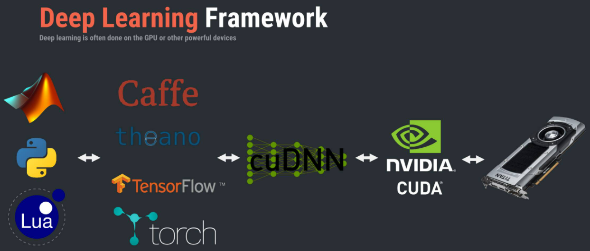
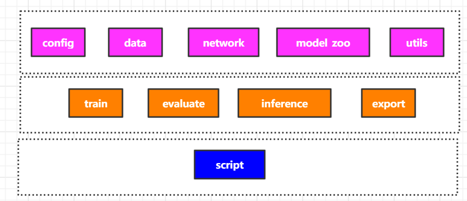
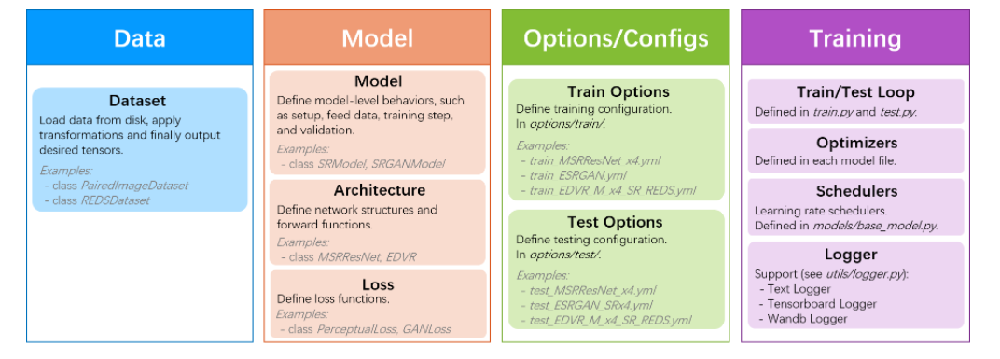

# 如何看懂和学习：深度学习应用型框架
个人简介：
wedo实验君-余养强, 数据分析师；热爱生活，热爱写作。微信号：mintel （米口）
## 1. 什么是应用型框架
深度学习做为当前人工智能最前沿的技术，已经在众多领域（如医疗，制造业等）和不同任务（图像分类，目标检测等）中取得了显著的成绩。各大头部企业也相继推出了深度学习基础框架，如google的TensorFlow，facebook的pytorch，AWS的mxnet，这些基础框架对深度学习的构建提供了便捷的函数功能，如：
- 深度神经网络常用的操作层：如卷积层，Pooling层，padding，BN，激活函数Activation，Recurrent Layers， dropout， 全连接层等
- 优化器Optimization：如Adam、SGD等
- 损失函数：Loss Function，如交叉熵等
- 数据准备加载：如TensorFlow的` tf.data.Dataset`， pytorch的`DataLoader`
- 反向传播算法：如pytorch的`torch.autograd`
- 常用的cuda Tensor操作
- ...

利用这些基础框架，我们可以构建不同的深度学习任务
- 构建图像分类模型（Image Classification）进行图像识别
- 构建目标检测模型（Objection Detection）进行指定目标的分类和目标定位
- 构建语义分割模型（Segmentation）进行像素级别的精确的定位
- 构建超分模型（Super-Resolution)进行图像增强
- ...



我们发现，相同的任务存在多种的不同的训练数据以及不同的算法等，因为是相同的任务所以也有很多相同或者相似的操作。如果不同的算法我们单独维护一个项目，不仅需要copy很多冗余的代码，而且增加维护的成本；特别是在科学研究进行试验对比时，相同的条件下的试验对照过程冗长容易出错，另外在比赛中也是如此，需要针对比赛场景，尝试比较多个算法，选择合适的算法。 

应用型框架就是在基础框架上构建某一类任务建模的框架，一方面抽离出任务的公共模块和流程，一方面可以公共流程中方便的加载不同的独立模块。

列举几个常见的应用型框架：
- 商汤OpenMMLab下面的：视觉基础mmcv、目标检测mmdetection、超分语义分割mmedit等
- facebook：目标检测Detectron2
- 目标检测SimpleDet
- 图像增强BasicSR：超分、去噪

## 2. 框架组成提炼
从深度学习训练和推理过程，可以将框架拆解如下：
- 数据：处理不同的数据集、数据加载和数据增强预处理
- 网络结构：深度学习网络结构
- 配置config：包括训练的参数配置、数据集配合、网络结构参数等
- 训练和评估：训练和评估的主过程，包括数据加载、模型结果加载、优化器、loss设定和学习率策略等
- 推理：调用模型参数直接进行推理
- 模型转换：模型导出和转换，方便不同设备和其他加速语言部署如TensorRT、TFServing，移动端MACE、TF-Lite等



## 3. 框架应用之python基础
框架的意义在第一小结已经介绍过了，就是将整过任务过程模块化，方便在同一个模块（小任务）下扩展不同的功能，如不同的网络结果。那框架是如何实现各种模块之间的松耦合的交互呢？ 本小节介绍框架中常用的python技巧，不管你是写框架还是学习一种新的框架，相信你都能用到，所谓万变不离其宗。
### 3.1 配置
配置可以说是每个框架中都会出现的功能模块；配置记录了各个模块可变要调整的部分。只要调整不同的配置就可以方便调用同一个模块下不同的功能，如调用不同的目标检测backbone，不同的目标检测方法。

python有很多库可以实现配置的管理，如ini文件、yml文件、xml文件、properties文件、txt文件和py文件等。

- mmdetection用的是py文件来管理配置，和普通的python没有区别
- Detectron2和BasicSR用的YAML来管理配置（yml文件）

这里介绍下YAML，简单就是将配置读取转换成嵌套的字典dict。

配置格式如下：用`:`来表示key和value，用缩进来表示嵌套，可以支持dict和list。

``` shell
name: 201_RCANx2_scratch_DIV2K_rand0
datasets:
  train:
    name: DIV2K
    type: PairedImageDataset
# network structures
network_g:
  rgb_mean: [0.4488, 0.4371, 0.4040]
```
python中用yaml包来管理YAML配置

``` python
import yaml
opt_path='../test.yml'
with open(opt_path, mode='r') as f:
    opt = yaml.load(f)

print(opt['name'])
print(opt['datasets']['train']['type'])
```

### 3.2 装饰器
框架中抽离很多公共的模块或者操作，这里除了利用面向对象的方式（class），很常用的另一个技巧是利用装饰器decorator

装饰器通常加载函数前面或者类前面，功能简单可以概括为为不同的函数和类添加同一样的额外的功能，如何给不同函数添加计时统计功能。

我们来看下装饰器是怎么运作的。

``` python
def cal_timer()
   def common_timer(task_func):
      print('call cal_timer')
      start_time = time.time()
      task_func()
      print('the running time is %s s' % (time.time()- start_time))
   return common_timer

@cal_timer
def real_func1():
   print('some function is running1')


real_func1()
# call cal_timer
# some function is running1
# the running time is 0. s

```
可以看出装饰器就是在指定的函数里加上一些装饰，通过函数里的函数来实现，被装饰的函数（也可以是类）作为一个对象传入装饰器里进行操作。

### 3.3 反射机制
反射机制可以理解为动态实例化的机制，在框架中十分常见。反射机制最主要的作用就是利用配置的类名字符串来动态实例化相应的类。python中的通过`importlib`和内置函数`getattr`来实现的。

我们来看下，假设有如下模块
```shell
./models
├── base_model.py
├── edvr_model.py
├── esrgan_model.py
```

``` python
import importlib
model_filenames = ['base_model', 'edvr_model']

## importlib.import_module 动态加载所有的model类和函数
_model_modules = [importlib.import_module(f'basicsr.models.{file_name}') for file_name in model_filenames]

# 通过模型字符串名称来动态实例化
model_type='BaseMoal'
for module in _model_modules:
    model_cls = getattr(module, model_type, None)
    if model_cls is not None:
        break
```

### 3.4 hook
hook就是我们常说的钩子函数，如果你写过winForm程序，里面各种按钮的事件监听函数就是hook的典型应用。hook只申明函数，具体函数的实现由真正需要的调用者来实现，如按钮暴露的onClinck()函数，具体点击后发生的事情有调用来实现。

mmdetection中很多Hook的应用，将训练的过程拆分不同的部分，如开始训练，结束训练，一个迭代训练完，一个epoch训练完等。将这些功能接口暴露给调用者，你可以自己决定在训练过程中监控哪些指标和更新哪些变量等。

我们来看下python中的实现方式，简单的就是先定义好事件函数，函数的参数是一个函数或者一个对象，或者通过注册的方式（俗称挂钩）注册需要执行的函数，然后在流程里调用。

``` python
class NumClassCheckHook(Object)：

    def register(self, runner):
        self.runner = runner

    def before_train_epoch(self):
    """Check whether the training dataset is compatible with head.
    Args:
        runner (obj:`EpochBasedRunner`): Epoch based Runner.
    """
    self._check_head(self.runner)

def before_val_epoch(self, runner):
    """Check whether the dataset in val epoch is compatible with head.
    Args:
        runner (obj:`EpochBasedRunner`): Epoch based Runner.
    """
    self._check_head(runner)
```


## 4. 深度学习框架BasicSR实战讲解
BasicSR是一个开源的，基于pytorch的深度学习Super-Resolution超分代码框架。 本小节我们来看下这个框架是如何运作的。

首先我们看下BasicSR 框架的拆解，如下：


- github： https://github.com/xinntao/BasicSR

### 4.1 **BasicSR目录结构**
``` shell
./
├── assets
├── basicsr       # 框架主要代码 
├── colab
├── datasets
├── docs
├── experiments    # 模型
├── inference      # 推理
├── LICENSE
├── MANIFEST.in
├── options         # 配置入口 yml
├── README_CN.md
├── README.md
├── requirements.txt
├── scripts
├── setup.cfg
├── setup.py
├── tb_logger
├── tests            # 单元测试
└── VERSION
```

### 4.2 basicsr框架代码
``` shell
./
├── archs              # 网络结构     arch.py	basicsr/archs/srresnet_arch.py
├── data               # 数据 dataloader 降质方法等 data/paired_image_dataset.py
├── __init__.py
├── losses             # loss
├── metrics            # 评估
├── models             # 模型训练相关定义，如优化器，loss，训练策略等 _model.py	basicsr/models/sr_model.py
├── ops                # 扩展层
├── test.py            # 测试入口
├── train.py           # 训练入口
├── utils
└── version.py

```

调用示例
``` shell
cd BasicSR
PYTHONPATH="./" CUDA_VISIBLE_DEVICES=0 python basicsr/train.py -opt options/train/RCAN/train_RCAN_x2.yml

```

可以看出BasicSR主要通过配置文件来


### 4.3 配置一览

BasicSR使用的是YAML配置, 支持dict list等，典型的每一层级是key，:之后是value。多个层级可以理解为嵌套dict，`opt['datasets]['train']['name'] == DIV2K`

下面是常见的配置选项，包含了训练和测试的整个流程，其中`model_type` 和`type`的值为对应类名的名称，如何SRModel和PairedImageDataset等。

``` shell
# general settings
name: 201_RCANx2_scratch_DIV2K_rand0
model_type: SRModel
scale: 2
num_gpu: 1  # set num_gpu: 0 for cpu mode
manual_seed: 10

# dataset and data loader settings
datasets:
  train:
    name: DIV2K
    type: PairedImageDataset
    dataroot_gt: ./SR_DATA/DIV2K/DIV2K_train_HR
    dataroot_lq: ./SR_DATA/DIV2K/DIV2K_train_LR_bicubic/X2
    # (for lmdb)
    # dataroot_gt: datasets/DIV2K/DIV2K_train_HR_sub.lmdb
    # dataroot_lq: datasets/DIV2K/DIV2K_train_LR_bicubic_X2_sub.lmdb
    filename_tmpl: '{}'
    io_backend:
      type: disk
      # (for lmdb)
      # type: lmdb

    gt_size: 96
    use_flip: true
    use_rot: true

    # data loader
    use_shuffle: true
    num_worker_per_gpu: 6
    batch_size_per_gpu: 16
    dataset_enlarge_ratio: 100
    prefetch_mode: ~

  val:
    name: Set5
    type: PairedImageDataset
    dataroot_gt: ./SR_DATA/Set5/HR
    dataroot_lq: ./SR_DATA/Set5/LRX2
    io_backend:
      type: disk

# network structures
network_g:
  type: RCAN
  num_in_ch: 3
  num_out_ch: 3
  num_feat: 64
  num_group: 10
  num_block: 20
  squeeze_factor: 16
  upscale: 2
  res_scale: 1
  img_range: 255.
  rgb_mean: [0.4488, 0.4371, 0.4040]

# path
path:
  pretrain_network_g: ~
  strict_load_g: true
  resume_state: ~

# training settings
train:
  optim_g:
    type: Adam
    lr: !!float 1e-4
    weight_decay: 0
    betas: [0.9, 0.99]

  scheduler:
    type: MultiStepLR
    milestones: [200000]
    gamma: 0.5

  total_iter: 300000
  warmup_iter: -1  # no warm up

  # losses
  pixel_opt:
    type: L1Loss
    loss_weight: 1.0
    reduction: mean

# validation settings
val:
  val_freq: !!float 5e3
  save_img: false

  metrics:
    psnr: # metric name, can be arbitrary
      type: calculate_psnr
      crop_border: 2
      test_y_channel: false

# logging settings
logger:
  print_freq: 100
  save_checkpoint_freq: !!float 5e3
  use_tb_logger: true
  wandb:
    project: ~
    resume_id: ~

# dist training settings
dist_params:
  backend: nccl
  port: 29500

```

### 4.4 调用入口讲解 `train.py`
train.py 囊括了pytorch的训练深度学习的所有过程，只不过对应的功能模块有各自相应的功能模块实现，而配置贯穿全程。

``` python
# 读取配置
opt = parse_options(root_path, is_train=True)
# 日志logger
logger, tb_logger = init_loggers(opt)

# 加载数据dataloader
result = create_train_val_dataloader(opt, logger)
train_loader, train_sampler, val_loader, total_epochs, total_iters = result
prefetcher = CPUPrefetcher(train_loader)

# 构建模型（网络，优化器, loss)
model = build_model(opt)

# 开始训练（batch data， 更新学习率，梯度反向传播，）
for epoch in range(start_epoch, total_epochs + 1):
    train_sampler.set_epoch(epoch)
    prefetcher.reset()
    train_data = prefetcher.next()

    while train_data is not None:
        data_time = time.time() - data_time

        current_iter += 1
        if current_iter > total_iters:
            break
        # update learning rate
        model.update_learning_rate(current_iter, warmup_iter=opt['train'].get('warmup_iter', -1))
        # training 反向传播
        model.feed_data(train_data)
        model.optimize_parameters(current_iter)
```

### 4.5 关键点： 根据配置名称来动态实例化
BasicSR通过注册器的方式，将不同的类的对象或者函数注册到dict里，在需要的时候根据配置名称进行获取对象，然后实例化。 注册器就是一个典型的装饰器应用。注意`def register(self, obj=None):`
- basicsr/utils/registry.py

    ``` python
    class Registry():
        def __init__(self, name):
            """
            Args:
                name (str): the name of this registry
            """
            self._name = name
            self._obj_map = {}

        def _do_register(self, name, obj):
            assert (name not in self._obj_map), (f"An object named '{name}' was already registered " f"in '{self._name}' registry!")
            self._obj_map[name] = obj

        def register(self, obj=None):
        """
        Register the given object under the the name `obj.__name__`.
        Can be used as either a decorator or not.
        See docstring of this class for usage.
        """
        if obj is None:
            # used as a decorator
            def deco(func_or_class):
                name = func_or_class.__name__
                self._do_register(name, func_or_class)
                return func_or_class

            return deco

    DATASET_REGISTRY = Registry('dataset')
    ARCH_REGISTRY = Registry('arch')
    MODEL_REGISTRY = Registry('model')
    LOSS_REGISTRY = Registry('loss')
    METRIC_REGISTRY = Registry('metric')
    ```

- 定义和注册模型 basicsr/models/sr_model.py
  
    这里以定义模型来说明如何注册模型类。很简单在每个类申明前加装饰器，如下是将类`SRModel`注册到MODEL_REGISTRY这字典中key是字符串SRModel中。

    ``` python
    @MODEL_REGISTRY.register()
    class SRModel(BaseModel):
        pass
    ```

- basicsr/models/__init__.py
    
    根据配置实例化模型
    - 通过`importlib.import_module`动态加载所有的模型
    - MODEL_REGISTRY这个字典里存储所有的模型， 通过配置`MODEL_REGISTRY.get(opt['model_type'])`获取对象，然后实例化

    ``` python
    import importlib
    from copy import deepcopy
    from os import path as osp

    from basicsr.utils import get_root_logger, scandir
    from basicsr.utils.registry import MODEL_REGISTRY

    __all__ = ['build_model']

    # automatically scan and import model modules for registry
    # scan all the files under the 'models' folder and collect files ending with
    # '_model.py'
    model_folder = osp.dirname(osp.abspath(__file__))
    model_filenames = [osp.splitext(osp.basename(v))[0] for v in scandir(model_folder) if v.endswith('_model.py')]
    # import all the model modules
    _model_modules = [importlib.import_module(f'basicsr.models.{file_name}') for file_name in model_filenames]


    def build_model(opt):
        """Build model from options.

        Args:
            opt (dict): Configuration. It must constain:
                model_type (str): Model type.
        """
        opt = deepcopy(opt)
        model = MODEL_REGISTRY.get(opt['model_type'])(opt)
        logger = get_root_logger()
        logger.info(f'Model [{model.__class__.__name__}] is created.')
        return model
    ```

## 5.总结
本文剖析了深度学习中的应用框架的作用意义和主要组成部分，并罗列了框架开发中常用的几种技巧实现，最后以BasicSR框架说明了框架的实现思路。总结如下：
- 应用型框架就是在基础框架上构建某一类任务建模的框架。
- 框架将整过任务过程模块化，抽离公共部分，组合模块
- 框架组成提炼：`数据`+`网络结构`+`配置`+`训练`+`推理`+`转换`
- 框架应用之python4个法宝：`配置YAMl`+`装饰器`+`反射机制`+`钩子hook`


