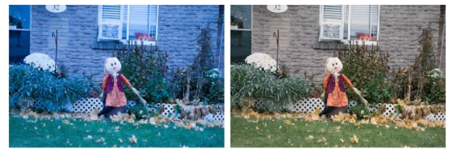
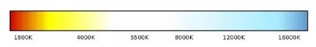
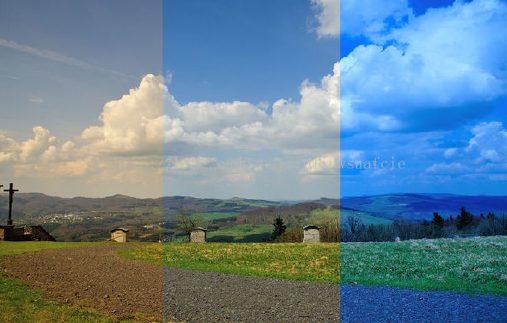
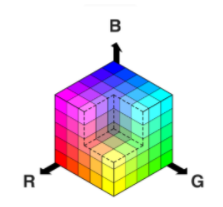
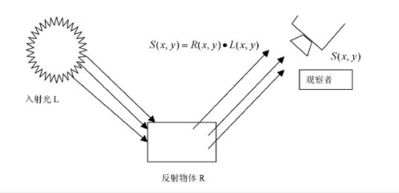
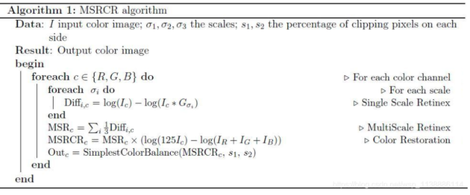
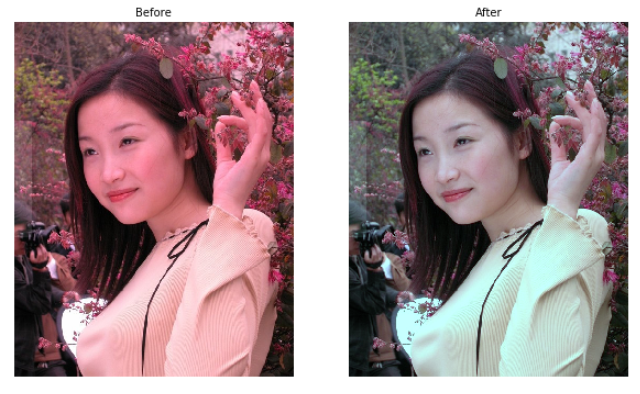
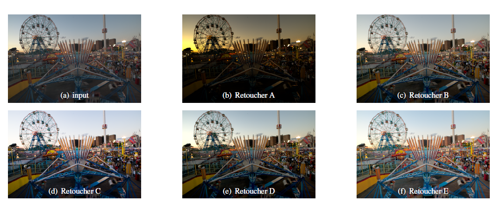
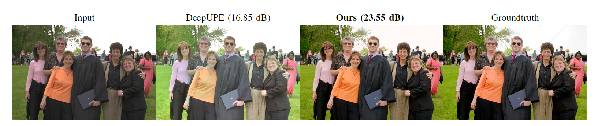

# 色彩增强（Color Enhancement）实战入门
个人简介：
wedo实验君-余养强, 数据分析师；热爱生活，热爱写作。微信号：mintel （米口）

## 1. 什么是色彩增强
现实中由于设备、拍摄技术和拍摄环境等不同的原因，所生成的图像存在色彩偏差，亮度异常（过暗或者过亮）以及颜色暗淡等问题。

色彩增强（Color Enhancement）是通过调节图片的色彩饱和度、亮度、对比度，使得图片色彩更加逼真的技术。根据应用的场景，色彩增强技术可以分为：
- 低光照图像增强：恢复图像的亮度和色彩度 （Low-Light Image Enhancement）
- 白平衡调整：在不同光线条件下，恢复图像中原有物体的固有色（White-Balanced Images）

    

- 颜色暗淡调整（如老照片，年度久远的动画片）：恢复图像的饱和度，对比度（Image Enhancement）

本文通过介绍色彩增强中的一些基本概念以及传统方法和深度学习算法实践，抛砖引玉。

## 2. 色彩增强概念必知必会
### 2.1 白平衡
白平衡和色温有直接的关系。我们用照相机在不同时候拍摄同一个物体时成像的物体颜色是不一样。这就是色温的影响，色温是用定量值（单位是开尔文K）来定义色彩。色温越低颜色越红，色温越高，颜色越蓝。一般情况下，中午的阳光色温为5600K色彩偏白， 烛光色温为1850K，色彩偏红， 日出日落色温3000k色彩偏黄。不同色温下的色彩如下图：



照相机是通过设置与当前光线合适的色温来真实还原物体的色彩。当给出具体的色温值，相机就会认为光源的颜色和色温一致，进而根据这个色温为基准，计算出照片的色彩。因为相机中色彩的还原是以白色为基色，将这个过程称之为白平衡。常见白平衡模式为：自动、日光、多云、阴天、钨丝灯(白炽灯)、闪光灯、荧光灯、色温值等。

不同色温下拍摄的图像差异



### 2.2 PS曲线工具
PS中曲线工具是调色的中常用的工具，通过在曲线上锚定不同的点，在改变图像像素值的分布。这里的曲线是SPLine样条曲线。


### 2.2 颜色空间
颜色空间又称为彩色空间，是在一个坐标空间对颜色的说明。
- RGB： 用RGB三原色表示颜色，是人眼识别颜色而定义出的空间。用于用于屏幕显示和视频输出



- HSV：H代表Hue（色彩），S代表Saturation（饱和度），V代表Value，也可用B表示（Brightness，明度）。HSV是为了更好的数字化颜色提出的空间


- LAB：由一个亮度通道（channel）和两个颜色通道组成的。在Lab颜色空间中，每个颜色用L、a、b三个数字表示。其中L代表亮度，a代表从绿色到红色的分量 ， b代表从蓝色到黄色的分量。LAB是CIE（国际照明委员会）根据人对颜色的感觉提出的色彩模型。


可以看出可以在各个颜色空间的不同维度上分量调整来进行色彩和亮度的调整，达到色彩增强的目的。

## 3. 传统算法
### 3.1 retinex方法
retinex理论将物体在我们眼中成像理解成光照在物体的反射结果。从下图可知要想恢复物体本身的颜色R，需要尽可能的减少光照L的影响。



我们做一个简单的数学变换，取log， 光照图像L一般可以估计为平滑的图像空间，可采用不同核函数的高斯模糊来实现。这就是单尺度的retinex算法


``` python
import numpy as np
import cv2

def singleScaleRetinex(img, sigma):
    retinex = np.log10(img) - np.log10(cv2.GaussianBlur(img, (0, 0), sigma))
    return retinex
```

在单尺度retinex基础上，针对如何更灵活的估计光照L和保留色彩度，有提出了不同的改进思路：
- 多尺度的retinex [MSR]： 简单的说每个通道用多个不同尺度的高斯核模糊来求平均
- 色彩恢复的MSR [MSRCR和MSRCP]

    

    

``` python
import numpy as np
import cv2

def singleScaleRetinex(img, sigma):

    retinex = np.log10(img) - np.log10(cv2.GaussianBlur(img, (0, 0), sigma))

    return retinex

def MSR(img, sigma_list):

    retinex = np.zeros_like(img)
    for sigma in sigma_list:
        retinex += singleScaleRetinex(img, sigma)

    retinex = retinex / len(sigma_list)

    return retinex

def colorRestoration(img, alpha, beta):

    img_sum = np.sum(img, axis=2, keepdims=True)

    color_restoration = beta * (np.log10(alpha * img) - np.log10(img_sum))

    return color_restoration

def simplestColorBalance(img, low_clip, high_clip):    

    total = img.shape[0] * img.shape[1]
    for i in range(img.shape[2]):
        unique, counts = np.unique(img[:, :, i], return_counts=True)
        current = 0
        for u, c in zip(unique, counts):            
            if float(current) / total < low_clip:
                low_val = u
            if float(current) / total < high_clip:
                high_val = u
            current += c
                
        img[:, :, i] = np.maximum(np.minimum(img[:, :, i], high_val), low_val)

    return img    

def MSRCR(img, sigma_list, G, b, alpha, beta, low_clip, high_clip):

    img = np.float64(img) + 1.0

    img_retinex = MSR(img, sigma_list)

    img_color = colorRestoration(img, alpha, beta)    
    img_msrcr = G * (img_retinex * img_color + b)

    for i in range(img_msrcr.shape[2]):
        img_msrcr[:, :, i] = (img_msrcr[:, :, i] - np.min(img_msrcr[:, :, i])) / \
                             (np.max(img_msrcr[:, :, i]) - np.min(img_msrcr[:, :, i])) * \
                             255
    
    img_msrcr = np.uint8(np.minimum(np.maximum(img_msrcr, 0), 255))
    img_msrcr = simplestColorBalance(img_msrcr, low_clip, high_clip)       

    return img_msrcr

def MSRCP(img, sigma_list, low_clip, high_clip):

    img = np.float64(img) + 1.0

    intensity = np.sum(img, axis=2) / img.shape[2]    

    retinex = multiScaleRetinex(intensity, sigma_list)

    intensity = np.expand_dims(intensity, 2)
    retinex = np.expand_dims(retinex, 2)

    intensity1 = simplestColorBalance(retinex, low_clip, high_clip)

    intensity1 = (intensity1 - np.min(intensity1)) / \
                 (np.max(intensity1) - np.min(intensity1)) * \
                 255.0 + 1.0

    img_msrcp = np.zeros_like(img)
    
    for y in range(img_msrcp.shape[0]):
        for x in range(img_msrcp.shape[1]):
            B = np.max(img[y, x])
            A = np.minimum(256.0 / B, intensity1[y, x, 0] / intensity[y, x, 0])
            img_msrcp[y, x, 0] = A * img[y, x, 0]
            img_msrcp[y, x, 1] = A * img[y, x, 1]
            img_msrcp[y, x, 2] = A * img[y, x, 2]

    img_msrcp = np.uint8(img_msrcp - 1.0)

    return img_msrcp
```
可以看出，对于光照的估计其实需要调整许多超参数才能有好的结果。测试图片Adobe-5k


### 3.2 白平衡方法
这里讲解一个常用白平衡算法：灰度世界算法； 灰度世界算法基于一个强假设：对于一幅有着大量色彩变化的图像的RGB三个分量的平均值趋于同一灰度值。这样我们对于有色差的图像，计算一个相对于这个灰度值的转换系数，就可以达到白平衡的效果。

这个灰度值可以采用固定值如128，也可以采用RGB通道的均值。
``` python
def gray_world_assumes_white_balance(img):
    """
    灰度世界假设
    :param img: cv2.imread读取的图片数据
    :return: 返回的白平衡结果图片数据
    """
    B, G, R = np.double(img[:, :, 0]), np.double(img[:, :, 1]), np.double(img[:, :, 2])
    B_ave, G_ave, R_ave = np.mean(B), np.mean(G), np.mean(R)
    K = (B_ave + G_ave + R_ave) / 3
    Kb, Kg, Kr = K / B_ave, K / G_ave, K / R_ave
    Ba = (B * Kb)
    Ga = (G * Kg)
    Ra = (R * Kr)

    Ba[Ba > 255] = 255
    Ga[Ga > 255] = 255
    Ra[Ra > 255] = 255

    # print(np.mean(Ba), np.mean(Ga), np.mean(Ra))
    dst_img = np.uint8(np.zeros_like(img))
    dst_img[:, :, 0] = Ba
    dst_img[:, :, 1] = Ga
    dst_img[:, :, 2] = Ra
    return dst_img
```
可想而知，如果图片色彩单一，特别是大色块的情况下，即假设不成立的情况，算法的效果不佳。Before测试图片来自网络，侵权请联系



## 4. 深度学习算法
深度学习在图像处理上的有着广泛的应用。在这里介绍两种不同的色彩增强的思路：
- 基于Retinex思路：Deep Retinex Decomposition for Low-Light Enhancement （2018）
- 基于曲线工具：CURL: Neural Curve Layers for Global Image Enhancement （2020）

其他思路：有基于GAN的方法和基于强化学习的方式

### 4.1 常用数据集
- Adobe-5k: 数据库中包含5000张dng格式的原始图片及分别由五个（A，B，C，D，E）专业修图人员手工修饰后的图片。关于该数据库的详细资料可以在：https://data.csail.mit.edu/graphics/fivek/
    
### 4.2 Retinex-net
Retinex-net借鉴了Retinex的思想来对低光图像增强的方法，整个网络分为三个部分：
- Decom分解网络：将输入图像S分解为反射图像R和光照图像L（S=R。L）
- 调整网络：主要是针对L来调整，作用是将L调亮。采用的类似U-net的
- 重构网络：将分解的R（加了去噪的操作）和调亮后的L相乘得到增强后的结果

具体见下图


可以看出图中有两个输入（配对的正常图片和低光图片），正常图片主要是为了指导训练网络的作用，整个训练过程需要不断优化三种loss
- 分解网络中正常图片的分解的放射图像R和低光图片分解的R差异要小（来评估分解的有效性）
- 在调整网络中：低光图像分解后的光亮L经过调整网络后的到调整后的光亮要和正常图片的分解的光亮图像差异小（来指导分解网络学习）
- 重构网络得到重构图和输入正常图像差异小（全局指导）

code传送门
- https://github.com/weichen582/RetinexNet  代码是基于tensorflow版本

    ``` python
    python main.py  \
    --use_gpu=1 \
    --gpu_idx=0 \
    --gpu_mem=0.5 \
    --phase=test \
    --test_dir=./RetinexNet/data/test/low \
    --save_dir=./test \
    --decom=0    
    ```


### 4.3 CURL
CURL这种思路借鉴了PS中曲线工具的调色方法，将它挪到深度学习框架中。总体框架如下：


从结构上看
- TED：先通过一个编解码网络（Encoder-Decoder），输出一个图像和一些特征，比如输入的是512x512x3的图像，输出为512x512x64（其中前3个通道为图像，剩余的通道为特征，这些特征是为后面学习调整曲线的参数的）; 
- CURL block： 接下来是分别在LAB/RGB/HSV空间上，用第一步特征加两个conv和一个fc层学习曲线调整参数，针对第一步中前3个通道进行调整。以此类推，最终得到就是512x512x3增强后的图像。曲线调整是通过学习一个分段线性函数来实现的。

其中TED模块如下：


- TED是Unet的一种调整，见上图中右下角，主结构还是下采样再上采样，不同的是skip-connection只在第一层。
- 第一层的skip-connection分为4个分支提取不同的特征，其中中间两路是不同感受野的特征提取，上面一路是全局特征提取。4个分支concat来作为总的特征

CURL采用了多个颜色空间的loss来控制学习的过程。


- code传送门： https://github.com/sjmoran/CURL （代码的环境pytorch版本比较低，高版本的需要做些调整）



### 4.4 自建数据集方法
有时候需要构建自己的数据来适应不同亮度和饱和度的应用场景。pytorch提供transforms.ColorJitter方法
``` python
import os
import torch
import torchvision
import torchvision.transforms as transforms
import cv2
import numpy as np
import shutil
from PIL import Image

brightness = (0.9, 0.98)
saturation = (0.7, 0.85)
img = Image.open('./data/test.png').convert('RGB')
transform1 = transforms.Compose([
    transforms.ColorJitter(brightness=brightness, contrast=0, saturation=saturation, hue=0)
    ])

process_img = transform1(img)
process_img.save(save_img)
```

## 5. 总结
本文介绍色彩增强的概念以及色彩增强的不同应用场景，并分别介绍传统方法和深度学习方法，希望对你有帮助。总结如下：
- 色彩增强： 调整低光图像，白平衡偏差图像和色彩暗淡图像
- 必知必会：白平衡，ps曲线工具原理和不同的色彩空间
- retinex方法
- 深度学习方法：retinex-base方法Retinex-Net， 曲线调整CURL以及GAN方法如DPE和增强学习方法如White-Box
- transforms.ColorJitter自制数据集


## 6. 参考资料
- Deep Retinex Decomposition for Low-Light Enhancement
- CURL: Neural Curve Layers for Global Image Enhancement
- DeepLPF(2020): DeepLPF Deep Local Parametric Filters for Image Enhancement 
- Deep Photo Enhancer: Unpaired Learning for Image Enhancement from Photographs with GANs
- White-Box(2018)： Exposure: A White-Box Photo Post-Processing Framework
- Distort-and-Recover(2018)：Distort-and-Recover: Color Enhancement using Deep Reinforcement Learning
- Zero-Reference Deep Curve Estimation for Low-Light Image Enhancement（2020）
- LLNet: A Deep Autoencoder approach to Natural Low-light Image Enhancement（2016）
- https://data.csail.mit.edu/graphics/fivek/