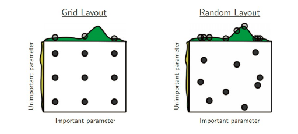
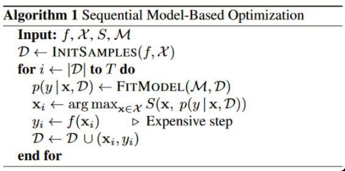

# python机器学习超参数调优

## 1.什么是超参数
超参数（hyper parameters）就是机器学习或深度学习算法中需要预先设置的参数，这些参数不是通过训练数据学习到的参数；原始算法一般只给出超参数的取值范围和含义，根据不同的应用场景，同一个算法的同一超参数设置也不同。

那超参数应该如何设置呢？似乎没有捷径，去尝试不同的取值，比较不同的结果取最好的结果。

本文整理了不同的尝试方法，如下：
- RandomSearch
- GridSearch
- 贝叶斯优化（Bayesian optimization）

## 2. GridSearchCV
暴力穷举是寻找最优超参数一种简单有效的方法，但是对于算法庞大的超参数空间来说,穷举会损耗大量的时间，特别是多个超参数情况下。GridSearchCV的做法是缩减了超参数值的空间，只搜索人为重要的超参数和有限的固定值。同时结合了交叉验证的方式来搜索最优的超参数。

拿lightgbm为例子：

``` python
import pandas as pd
import numpy as np
import math
import warnings
import lightgbm as lgb
from sklearn.model_selection import GridSearchCV
from sklearn.model_selection import RandomizedSearchCV

lg = lgb.LGBMClassifier(silent=False)
param_dist = {"max_depth": [2, 3, 4, 5, 7, 10],
              "n_estimators": [50, 100, 150, 200],
              "min_child_samples": [2,3,4,5,6]
             }

grid_search = GridSearchCV(estimator=lg, n_jobs=10, param_grid=param_dist, cv = 5, scoring='f1', verbose=5)
grid_search.fit(X_train, y)
grid_search.best_estimator_, grid_search.best_score_

# Fitting 5 folds for each of 120 candidates, totalling 600 fits
# [Parallel(n_jobs=10)]: Using backend LokyBackend with 10 concurrent workers.
# [Parallel(n_jobs=10)]: Done  52 tasks      | elapsed:    2.5s
# [Parallel(n_jobs=10)]: Done 142 tasks      | elapsed:    6.6s
# [Parallel(n_jobs=10)]: Done 268 tasks      | elapsed:   14.0s
# [Parallel(n_jobs=10)]: Done 430 tasks      | elapsed:   25.5s
# [Parallel(n_jobs=10)]: Done 600 out of 600 | elapsed:   40.6s finished
# (LGBMClassifier(max_depth=10, min_child_samples=6, n_estimators=200,
#                 silent=False), 0.6359524127649383)
```

从上面可知，`GridSearchCV`搜索过程
- 模型estimator： lgb.LGBMClassifier
- param_grid： 模型的超参数，上面例子给出了3个参数，值得数量分别是6，4，5，组合起来的搜索空间是120个
- cv： 交叉验证的折数（上面例子5折交叉）， 算法训练的次数总共为120*5=600
- scoring：模型好坏的评价指标分数，如F1值
- 搜索返回: 最好的模型 best_estimator_和最好的分数

> https://scikit-learn.org/stable/modules/generated/sklearn.model_selection.GridSearchCV.html#sklearn.model_selection.GridSearchCV

## 3. RandomSearchCV
和`GridSearchCV`一样，`RandomSearchCV`也是在有限的超参数空间（人为重要的超参数）中搜索最优超参数。 不一样的地方在于搜索超参数的值不是固定，是在一定范围内随机的值。不同超参数值的组合也是随机的。值的随机性可能会弥补`GridSearchCV`超参数值固定的有限组合，但也可能更坏。

``` shell
Better than grid search in various senses but still expensive to guarantee good coverage
```



``` python
import pandas as pd
import numpy as np
import math
import warnings
import lightgbm as lgb
from scipy.stats import uniform
from sklearn.model_selection import GridSearchCV
from sklearn.model_selection import RandomizedSearchCV

lg = lgb.LGBMClassifier(silent=False)
param_dist = {"max_depth": range(2,15,1),
              "n_estimators": range(50,200,4),
              "min_child_samples": [2,3,4,5,6],
             }

random_search = RandomizedSearchCV(estimator=lg, n_jobs=10, param_distributions=param_dist, n_iter=100, cv = 5, scoring='f1', verbose=5)
random_search.fit(X_train, y)
random_search.best_estimator_, random_search.best_score_

# Fitting 5 folds for each of 100 candidates, totalling 500 fits
# [Parallel(n_jobs=10)]: Using backend LokyBackend with 10 concurrent workers.
# [Parallel(n_jobs=10)]: Done  52 tasks      | elapsed:    6.6s
# [Parallel(n_jobs=10)]: Done 142 tasks      | elapsed:   12.9s
# [Parallel(n_jobs=10)]: Done 268 tasks      | elapsed:   22.9s
# [Parallel(n_jobs=10)]: Done 430 tasks      | elapsed:   36.2s
# [Parallel(n_jobs=10)]: Done 500 out of 500 | elapsed:   42.0s finished
# (LGBMClassifier(max_depth=11, min_child_samples=3, n_estimators=198,
#                 silent=False), 0.628180299445963)
```
从上可知，基本和`GridSearchCV`类似，不同之处如下：
- n_iter： 随机搜索值的数量
- param_distributions： 搜索值的范围，除了list之外，也可以是某种分布如uniform均匀分布等

> https://scikit-learn.org/stable/modules/generated/sklearn.model_selection.RandomizedSearchCV.html#sklearn.model_selection.RandomizedSearchCV


## 4. 贝叶斯优化（Bayesian optimization）
不管是`GridSearchCV`还是`RandomSearchCV`, 都是在调参者给定的有限范围内搜索全部或者部分参数的组合情况下模型的最佳表现；可想而知最优模型参数取决于先验的模型参数和有限范围，某些情况下并一定是最优的， 而且暴力搜索对于大的候选参数空间也是很耗时的。

我们换了角度来看待参数搜索的问题：我们的目的是选择一个最优的参数组合，使得训练的模型在给定的数据集上表现最好，所以可以理解成是一个最优化问题。

我们通常使用梯度下降的方式来迭代的计算最优值，但是梯度下降要求优化的函数是固定并且是可导的，如交叉熵loss等。对于参数搜索问题， 我们要在众多模型（不同的超参）中找一个效果最好的模型，判断是否最好是由模型决定的，而模型是一个黑盒子，不知道是什么结构，以及是否是凸函数，是没办法使用梯度下降方法。

这种情况下，贝叶斯优化是一种解决方案。贝叶斯优化把搜索的模型空间假设为高斯分布，利用高斯过程，按迭代的方式每次计算得到比当前最优参数期望提升的新的最优参数。

通用的算法如下：



- Input：f是模型， M是高斯拟合函数， X是参数， S是参数选择算法Acquisition Function
- 初始化高斯分布拟合的数据集D，为（x,y)， x是超参数，y是超参数的x的执行结果（如精确率等）
- 迭代T次
- 每次迭代，用D数据集拟合高斯分布函数
- 根据拟合的函数，根据Acquisition Function(如Expected improvement算法)，在参数空间选择一个比当前最优解更优的参数xi
- 将参数xi代入模型f（训练一个模型），得出相应的yi（新模型的精确率等）
- (xi,yi)重新加入拟合数据集D，再一次迭代

由此可知，贝叶斯优化每次都利用上一次参数选择。而`GridSearchCV`和`RandomSearchCV`每一次搜索都是独立的。

到此，简单介绍了贝叶斯优化的理论知识。有很多第三方库实现了贝叶斯优化的实现，如 `advisor`，`bayesian-optimization `，`Scikit-Optimize`和`GPyOpt`等。本文以`GPyOpt`和`bayesian-optimization `为例子。

``` shell
pip install gpyopt
pip install bayesian-optimization
pip install scikit-optimize
```

- gpyopt例子
``` python
import GPy
import GPyOpt
from GPyOpt.methods import BayesianOptimization
from sklearn.model_selection import train_test_split
from sklearn.model_selection import cross_val_score
from sklearn.datasets import load_iris
from xgboost import XGBRegressor
import numpy as np
 
 
iris = load_iris()
X = iris.data
y = iris.target
 
 
x_train, x_test, y_train, y_test = train_test_split(X,y,test_size = 0.3,random_state = 14)
 
# 超参数搜索空间
bds = [{'name': 'learning_rate', 'type': 'continuous', 'domain': (0, 1)},
        {'name': 'gamma', 'type': 'continuous', 'domain': (0, 5)},
        {'name': 'max_depth', 'type': 'continuous', 'domain': (1, 50)}]
 
 
# Optimization objective 模型F
def cv_score(parameters):
    parameters = parameters[0]
    score = cross_val_score(
                XGBRegressor(learning_rate=parameters[0],
                              gamma=int(parameters[1]),
                              max_depth=int(parameters[2])), 
                X, y, scoring='neg_mean_squared_error').mean()
    score = np.array(score)
    return score
 

# acquisition就是选择不同的Acquisition Function
optimizer = GPyOpt.methods.BayesianOptimization(f = cv_score,            # function to optimize       
                                          domain = bds,         # box-constraints of the problem
                                          acquisition_type ='LCB',       # LCB acquisition
                                          acquisition_weight = 0.1)   # Exploration exploitation
 
 
x_best = optimizer.X[np.argmax(optimizer.Y)]
print("Best parameters: learning_rate="+str(x_best[0])+",gamma="+str(x_best[1])+",max_depth="+str(x_best[2]))
# Best parameters: learning_rate=0.4272184438229706,gamma=1.4805727469635759,max_depth=41.8460390442754
```


- bayesian-optimization例子
``` python
from sklearn.datasets import make_classification
from xgboost import XGBRegressor
from sklearn.model_selection import cross_val_score
from bayes_opt import BayesianOptimization

iris = load_iris()
X = iris.data
y = iris.target
 
 
x_train, x_test, y_train, y_test = train_test_split(X,y,test_size = 0.3,random_state = 14)
bds ={'learning_rate': (0, 1),
        'gamma': (0, 5),
        'max_depth': (1, 50)}

# Optimization objective 
def cv_score(learning_rate, gamma,  max_depth):
    score = cross_val_score(
                XGBRegressor(learning_rate=learning_rate,
                              gamma=int(gamma),
                              max_depth=int(max_depth)), 
                X, y, scoring='neg_mean_squared_error').mean()
    score = np.array(score)
    return score

rf_bo = BayesianOptimization(
        cv_score,
        bds
    )
rf_bo.maximize()
rf_bo.max 

|   iter    |  target   |   gamma   | learni... | max_depth |
-------------------------------------------------------------
|  1        | -0.0907   |  0.7711   |  0.1819   |  20.33    |
|  2        | -0.1339   |  4.933    |  0.6599   |  8.972    |
|  3        | -0.07285  |  1.55     |  0.8247   |  33.94    |
|  4        | -0.1359   |  4.009    |  0.3994   |  25.55    |
|  5        | -0.08773  |  1.666    |  0.9551   |  48.67    |
|  6        | -0.05654  |  0.0398   |  0.3707   |  1.221    |
|  7        | -0.08425  |  0.6883   |  0.2564   |  33.25    |
|  8        | -0.1113   |  3.071    |  0.8913   |  1.051    |
|  9        | -0.9167   |  0.0      |  0.0      |  2.701    |
|  10       | -0.05267  |  0.0538   |  0.1293   |  1.32     |
|  11       | -0.08506  |  1.617    |  1.0      |  32.68    |
|  12       | -0.09036  |  2.483    |  0.2906   |  33.21    |
|  13       | -0.08969  |  0.4662   |  0.3612   |  34.74    |
|  14       | -0.0723   |  1.295    |  0.2061   |  1.043    |
|  15       | -0.07531  |  1.903    |  0.1182   |  35.11    |
|  16       | -0.08494  |  2.977    |  1.0      |  34.57    |
|  17       | -0.08506  |  1.231    |  1.0      |  36.05    |
|  18       | -0.07023  |  2.81     |  0.838    |  36.16    |
|  19       | -0.9167   |  1.94     |  0.0      |  36.99    |
|  20       | -0.09041  |  3.894    |  0.9442   |  35.52    |
|  21       | -0.1182   |  3.188    |  0.01882  |  35.14    |
|  22       | -0.08521  |  0.931    |  0.05693  |  31.66    |
|  23       | -0.1003   |  2.26     |  0.07555  |  31.78    |
|  24       | -0.1018   |  0.08563  |  0.9838   |  32.22    |
|  25       | -0.1017   |  0.8288   |  0.9947   |  30.57    |
|  26       | -0.9167   |  1.943    |  0.0      |  30.2     |
|  27       | -0.08506  |  1.518    |  1.0      |  35.04    |
|  28       | -0.08494  |  3.464    |  1.0      |  32.36    |
|  29       | -0.1224   |  4.296    |  0.4472   |  33.47    |
|  30       | -0.1017   |  0.0      |  1.0      |  35.86    |
=============================================================
{'target': -0.052665895082105285,
 'params': {'gamma': 0.05379782654053811,
  'learning_rate': 0.1292986176550608,
  'max_depth': 1.3198257775801387}}

```
> bayesian-optimization只支持最大化，如果score是越小越好，可以加一个负号转化为最大值优化。

两者的优化结果并不是十分一致的，可能和实现方式和选择的算法不同，也和初始化的拟合数据集有关系。

## 5. 总结
本文介绍三种超参数优化的策略，希望对你有帮助。简要总结如下：
-  GridSearchCV网格搜索，给定超参和取值范围，遍历所有组合得到最优参数。首先你要给定一个先验的取值，不能取得太多，否则组合太多，耗时太长。可以启发式的尝试。
- RandomSearchCV随机搜索，搜索超参数的值不是固定，是在一定范围内随机的值
- 贝叶斯优化，采用高斯过程迭代式的寻找最优参数，每次迭代都是在上一次迭代基础上拟合高斯函数上，寻找比上一次迭代更优的参数，推荐gpyopt库

## 6. 参考资料
- A Tutorial on Bayesian Optimization
- https://zhuanlan.zhihu.com/p/93683454
- https://zhuanlan.zhihu.com/p/29779000
- https://zhuanlan.zhihu.com/p/53826787

