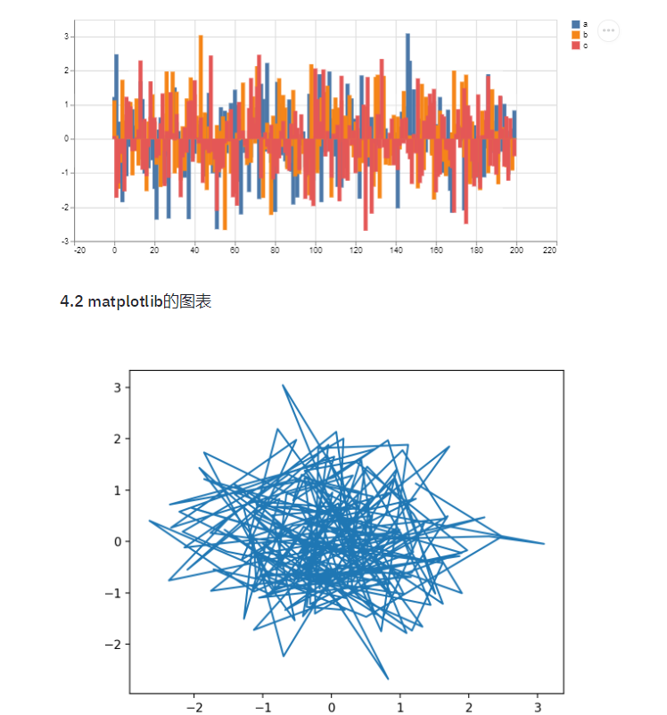

# 用纯python写web app：Streamlit
个人简介：
wedo实验君, 数据分析师；热爱生活，热爱写作
## 1. Streamlit
一句话，Streamlit是一个可以用python编写web app的库，可以方便的动态展示你的机器学习的项目。

优点
- 你不需要懂html， css， js等，纯python语言编写web app
- 包括web常用组件：文本框， 按钮，单选框，复选框， 下拉框，多媒体（图片，视频）和文件上传等

应用场景
- 可以动态的探索数据
- 可以方便动态展示你的机器学习成果（可以和jupyter notebook做个比较）

> https://github.com/streamlit/streamlit

## 2. 安装

```python
pip install streamlit
```

```bash
streamlit hello

# 启动web app
# streamlit run [filename]
streamlit run app.py

# You can now view your Streamlit app in your browser.
# Local URL: http://localhost:8501
```

## 3. 基本组件介绍
### 3.1 布局
web中通常有布局layout css, 如Bootstrap中的12列删格系统；streamlit最多只有左右两栏，通常是一栏。 通过`st.sidebar`添加侧边栏，通常可作为菜单，选择控制操作。在上下结构上，streamlit按照代码顺序从上到下，依次布局

```python
import streamlit as st
import numpy as np
import time
import pandas as pd
import datetime
# 侧边栏
st.sidebar.title('菜单侧边栏')
add_selectbox = st.sidebar.selectbox(
    "这个是下拉框，请选择?",
    ("1", "Home 2", "Mobile 2")
)
# 主栏
st.title('Steamlit 机器学习web app')
```


### 3.2 text
streamlit提供了许多文本显示命令，还支持markdown语法
```python
st.header('1. text文本显示')
st.markdown('Streamlit is **_really_ cool**.')
st.text('This is some text.')
st.subheader('This is a subheader')
st.write("st.write 可以写很多东西哦")
st.warning('This is a warning')
```

### 3.3 表单控件
streamlit提供丰富的表单控件，如按钮，单选框，复选框，下拉框，文本框和文件上传。
用法提炼如下：
- 函数调用为定义显示控件，返回值是表示是否触发，或者触发返回结果；比如按钮，`st.button('Say hello')`定义了一个按钮， 如果按下按钮返回True，否则为False
```python
st.markdown('- 按钮')
if st.button('Say hello'):
    st.write('Why hello there')

st.markdown('- 单选框')
genre = st.radio(
     "选择你喜欢的？",
    ('Comedy', 'Drama', 'Documentary'))

st.write('你选择了：', genre)
 

st.markdown('- 复选框')    
agree = st.checkbox('I agree')
if agree:
    st.write('感谢你同意了')


st.markdown('- 下拉框') 
option = st.selectbox(
    '你喜欢的联系方式?',
   ('Email', 'Home phone', 'Mobile phone'))

st.write('你选择了:', option)

st.markdown('- 多选下拉框') 
options = st.multiselect(
    'What are your favorite colors',
    ['Green', 'Yellow', 'Red', 'Blue'],
    ['Yellow', 'Red'])

st.write('你选择了:', options)

st.markdown('- slider') 
values = st.slider(
    'Select a range of values',
    0.0, 100.0, (25.0, 75.0))
st.write('Values:', values)


st.markdown('- 文本输入') 
title = st.text_input('Movie title', 'Life of Brian')
st.write('The current movie title is', title)

txt = st.text_area('Text to analyze', '''
    It was the best of times, it was the worst of times, it was
    the age of wisdom, it was the age of foolishness, it was
    the epoch of belief, it was the epoch of incredulity, it
    was the season of Light, it was the season of Darkness, it
    was the spring of hope, it was the winter of despair, (...)
    ''')


st.markdown('- 日期与时间')
d = st.date_input(
    "生日",
    datetime.date(2019, 7, 6))
st.write('Your birthday is:', d)

t = st.time_input('闹钟', datetime.time(8, 45))
st.write('闹钟为：', t)

st.markdown('- 上传文件')
uploaded_file = st.file_uploader("Choose a CSV file", type="csv")
if uploaded_file is not None:
    data = pd.read_csv(uploaded_file)
    st.write(data)
```


### 3.4 图像
常用的图像库都支持，通过`st.image`展示图片
```python
import cv2
img = cv2.imread('sunrise.jpg')
st.image(img[...,::-1], caption='Sunrise by the mountains',
        use_column_width=True)
```
### 3.5 图表
- 支持pandas中的dataframe展示图表（折线图，面积图和柱状图）
```python
st.subheader('4.1 dataframe图表')
@st.cache(persist=True)
def get_data():
    df = pd.DataFrame(
    np.random.randn(200, 3),
    columns=['a', 'b', 'c'])
    return df
df = get_data()
# st.table(df)
st.dataframe(df) 
st.line_chart(df)
st.area_chart(df)
st.bar_chart(df)
```
- 还支持matplotlib的图表展示，这个你应该很熟悉
```python
plt.plot(df.a, df.b)
st.pyplot()
```


### 3.6 缓存
streamlit中数据的缓存使用`st.cache`装饰器来修饰， 注意是作用于函数。缓存的好处顾名思义就是避免每次刷新的时候都要重新加载数据。
```python
@st.cache(persist=True)
def get_data():
    df = pd.DataFrame(
    np.random.randn(200, 3),
    columns=['a', 'b', 'c'])
    return df
```

## 4. 动态数据demo
```python
import streamlit as st
import numpy as np
import matplotlib.pyplot as plt
import pandas as pd
# 侧边栏
st.sidebar.title('请选择过滤条件')
time = st.sidebar.time_input('大于时间', datetime.time(1, 0))

values = st.sidebar.slider(
    '速度',
    0.0, 200.0, (25.0, 75.0))
# 主栏
st.title('数据探索')
@st.cache(persist=True)
def get_data():
    file = './7000.csv'
    return pd.read_csv(file, header=0)
data = get_data()
# print(values)
display_data = data[data['time'] > str(time)]
display_data = display_data[(display_data['速度'] > values[0]) & (display_data['速度'] < values[1])]
st.line_chart(display_data[['方向', '速度']])
```


## 5. 机器视觉项目demo
这个例子我们用`人脸检测`来说明下机器视觉项目的展示。
- 功能：上传一张图片，检测出人脸框
- 人脸检测算法来自facenet项目`https://github.com/davidsandberg/facenet/tree/master/src/align`中的MTCNN算法
- 布局为左右布局，左边为上传空间， 右边是展示
```python
import streamlit as st
import numpy as np
import matplotlib.pyplot as plt
import time
import pandas as pd
import datetime
import cv2
from PIL import Image
import io
from face_detect.mtcnn_tf import MTCNN

# 侧边栏
st.sidebar.title('请上传一张照片，开始检测')
uploaded_file = st.sidebar.file_uploader("", type="jpg")

# 主栏
st.title('人脸检测')
@st.cache()
def init_model():
    mtcnn = MTCNN()
    return mtcnn

detect = init_model()
if uploaded_file is not None:
    # print(uploaded_file)
    data = np.array(Image.open(io.BytesIO(uploaded_file.read())))
    _, bboxs, _, _ = detect.run(data, detect_multiple_faces=True, margin=0)
    # display bbox and landmarks
    for idx, landmark in enumerate(landmarks):
        bbox = bboxs[idx]
        cv2.rectangle(data, (bbox[1], bbox[0]),
                      (bbox[3], bbox[2]), (0, 2255, 0), 2)
    st.image(data, caption='image', use_column_width=False)
```


## 6. 总结
是不是觉得很方便，分分钟就可以构建一个web app来展示你的项目。希望对你有帮助, 快动起手来吧!
摘要如下：
- 数据记得要用缓存`@st.cache()`
- streamlit可以支持matplotlib
- streamlit有漂亮的表单控件，函数的返回值就是触发的值
- streamlit支持markdown
  
官方提供了其他复杂的demo（官方推荐用函数的方式的封装业务，这里也推荐， 本文主要是为了说明功能，采用比较直观的方式来编写）
- https://github.com/streamlit/demo-face-gan
- https://github.com/streamlit/demo-self-driving


