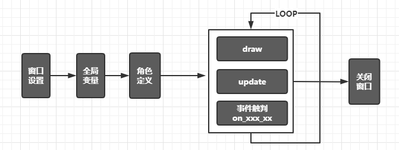
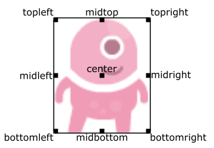
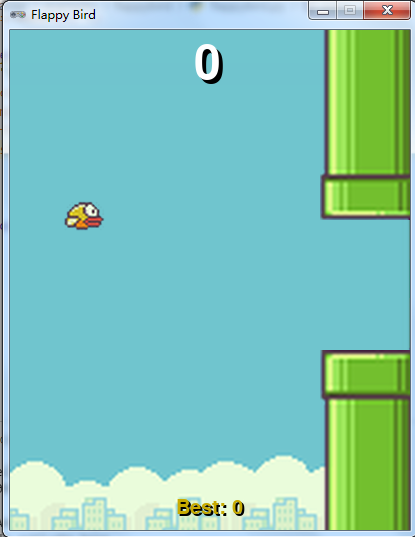

# python游戏开发-pgzero

## 1. pgzero
python在各个领域都有着丰富的第三方库，pygame是python在游戏领域的应用库，可以用来开发各种不同的游戏。但是对于初学者来说，还是存在一定的门槛。

而今天要和大家分享的pgzero（pygame zero）是在pygame基础上做了进一步的封装，使得设计一款游戏十分的方便，特别适合少儿编程领域的教学, 与scratch相得益彰。

- pgzero的安装
    ``` shell
    pip install pygame
    pip install pgzero
    ```

## 2. 游戏设计的过程
我们可以简单梳理下开发一款简单游戏需要的过程：
- 游戏的故事设计
- 游戏的场景绘制（背景图片和声音）
- 游戏的角色
- 如何控制角色
- 如何判断成功与失败
- 游戏的关卡设计

## 3. pgzero基础
pgzero游戏开发的过程如下：


- 游戏屏幕区域screen
  pgzero中游戏界面窗口设置由全局变量和内置对象screen来完成：
  - 窗口外观：`WIDTH` , `HEIGHT` 和`TITLE` 
  - 窗口清楚：`screen.clear()`
  - 窗口背景颜色：`screen.fill((red, green, blue))`
  - 在窗口绘制图像：`screen.blit(image, (left, top))`
  - 在窗口绘制几何图案：`screen.draw.line` `screen.draw.circle` `screen.draw.rect`  
- 游戏角色Actor
  pgzero中所有以图片显示的元素都是Actor类来定义。
  ``` python
  # 'alien' 表示alien图片，默认是images/alien.png
  # (50, 50) 定义了Actor在窗口上显示的位置
  alien = Actor('alien', (50, 50))
  ```
  Actor的位置：
  

  Actor重要属性和方法：
  - 外观： image， 如`alien.image = 'alien_hurt'`
  - 位置: piex坐标值：x,y, 设置位置：pos，left/right/top/bottom
  - 角度：angle
  - 绘制f方法：draw()
  - 距离方法: `Actor.distance_to(target)`
  - 角度方法：`Actor.angle_to(target)`
  
  其他属性同`pygame.Rect`

- 游戏渲染绘制draw
- 游戏状态的更新update
- 游戏外部事件的触发控制on_xxx_xxx
  pgzero提供了常用的鼠标和键盘事件
  - 键盘事件:on_key_down, on_key_up
  - 鼠标事件：on_mouse_down， on_mouse_up, on_mouse_move
  
   键盘的按键信息是通过`keyboard`内置对象获取的，鼠标是`mouse`来获取的，如：
   ``` shell
    keyboard.a  # The 'A' key
    keyboard.left  # The left arrow key
    keyboard.rshift  # The right shift key
    keyboard.kp0  # The '0' key on the keypad
    keyboard.k_0  # The main '0' key

    mouse.LEFT
    mouse.RIGHT
    mouse.MIDDLE
   ```
   详见
   - https://pygame-zero.readthedocs.io/en/stable/hooks.html#mouse.WHEEL_DOWN

其他重要元素
- 声音 sounds： 支持wav和ogg， 资源对象目录默认为./sounds
  ``` python
  # 播放声音./sounds/drum.wav
  sounds.drum.play()
  ```
- 音乐 music: 支持mp3, 主要是时间较长的音频文件。资源对象目录默认为./music
  ``` python
  # 播放声音./music/drum.mp3
  music.play('drum')
  ```
- 动画效果Animations，如移动角色到某个位置
  ``` ptyhon
  # animate(object, tween='linear', duration=1, on_finished=None, **targets)
  animate(alien, pos=(100, 100))
  ```
  详见：https://pygame-zero.readthedocs.io/en/stable/builtins.html#Animations

## 4. pgzero游戏例子
了解了pgzero的基本使用情况，下面来举一个例子，将游戏编写制作的过程串起来。

我们来模拟手机上的一款游戏FlappyBird。游戏简单操作说明
``` shell
在《FlappyBird》这款游戏中，玩家只需要用一根手指来操控，点击触摸屏幕，小鸟就会往上飞，不断的点击就会不断的往高处飞。放松手指，则会快速下降。所以玩家要控制小鸟一直向前飞行，然后注意躲避途中高低不平的管子。 [3] 
1、在游戏开始后，点击屏幕，要记住是有间歇的点击屏幕，不要让小鸟掉下来。
2、尽量保持平和的心情，点的时候不要下手太重，尽量注视着小鸟。
3、游戏的得分是，小鸟安全穿过一个柱子且不撞上就是1分。当然撞上就直接挂掉，只有一条命。
```

pgzero游戏代码结构：
``` python
import pgzrun

# 全局变量和初始化信息
TITLE = 'xxx'
WIDTH = 400
HEIGHT = 500

# 绘制游戏元素
def draw():
    pass

# 更新游戏状态
def update():
    pass

# 处理键盘事件
def on_key_down():
    pass

# 处理键盘事件
def on_mouse_down():
    pass

# 执行
pgzrun.go()
```

``` python
import pgzrun
import random


TITLE = 'Flappy Bird'
WIDTH = 400
HEIGHT = 500

# These constants control the difficulty of the game
GAP = 130
GRAVITY = 0.3
FLAP_STRENGTH = 6.5
SPEED = 3

# bird 
bird = Actor('bird1', (75, 200))
bird.dead = False
bird.score = 0
bird.vy = 0

storage = {}
storage['highscore'] = 0


def reset_pipes():
    # 设置随机的高度
    pipe_gap_y = random.randint(200, HEIGHT - 200)
    pipe_top.pos = (WIDTH, pipe_gap_y - GAP // 2)
    pipe_bottom.pos = (WIDTH, pipe_gap_y + GAP // 2)


pipe_top = Actor('top', anchor=('left', 'bottom'))
pipe_bottom = Actor('bottom', anchor=('left', 'top'))
reset_pipes()  # Set initial pipe positions.


def update_pipes():
    # 不断的移动柱子
    pipe_top.left -= SPEED
    pipe_bottom.left -= SPEED
    if pipe_top.right < 0:
        reset_pipes()
        if not bird.dead:
            bird.score += 1
            if bird.score > storage['highscore']:
                storage['highscore'] = bird.score


def update_bird():
    # 小鸟下降
    uy = bird.vy
    bird.vy += GRAVITY
    bird.y += (uy + bird.vy) / 2
    bird.x = 75

    # 根据小鸟死亡切换小鸟的造型
    if not bird.dead:
        if bird.vy < -3:
            bird.image = 'bird2'
        else:
            bird.image = 'bird1'

    # 判断小鸟死亡： 是否触碰柱子
    if bird.colliderect(pipe_top) or bird.colliderect(pipe_bottom):
        bird.dead = True
        bird.image = 'birddead'

    # 小鸟超过边界 初始化
    if not 0 < bird.y < 720:
        bird.y = 200
        bird.dead = False
        bird.score = 0
        bird.vy = 0
        reset_pipes()


def update():
    update_pipes()
    update_bird()

# 按下任意键， 小鸟上升
def on_key_down():
    if not bird.dead:
        bird.vy = -FLAP_STRENGTH

# 
def draw():
    # 背景图片
    screen.blit('background', (0, 0))
    
    # 加载小鸟/柱子
    pipe_top.draw()
    pipe_bottom.draw()
    bird.draw()

    # 显示分数和最佳
    screen.draw.text(
        str(bird.score),
        color='white',
        midtop=(WIDTH // 2, 10),
        fontsize=70,
        shadow=(1, 1)
    )
    screen.draw.text(
        "Best: {}".format(storage['highscore']),
        color=(200, 170, 0),
        midbottom=(WIDTH // 2, HEIGHT - 10),
        fontsize=30,
        shadow=(1, 1)
    )


pgzrun.go()

```


## 5. 总结
本文分享了基于pygame封装版的pgzero开发python游戏的过程，希望对您有帮助。
总结如下：
- pgzero开发三剑客：draw() / update() / on_xxx_xxx()
- pgzero内置对象：screen负责窗口设置，Actor负责图像显示，sounds负责短音频，music负责长音频bgm，动画效果有animate
- pgzero资源目录：./images/xxx.png ./music/xxx.mp3  ./sounds/xxx/wav

## 6. 参考资料
- https://pygame-zero.readthedocs.io/en/stable/

