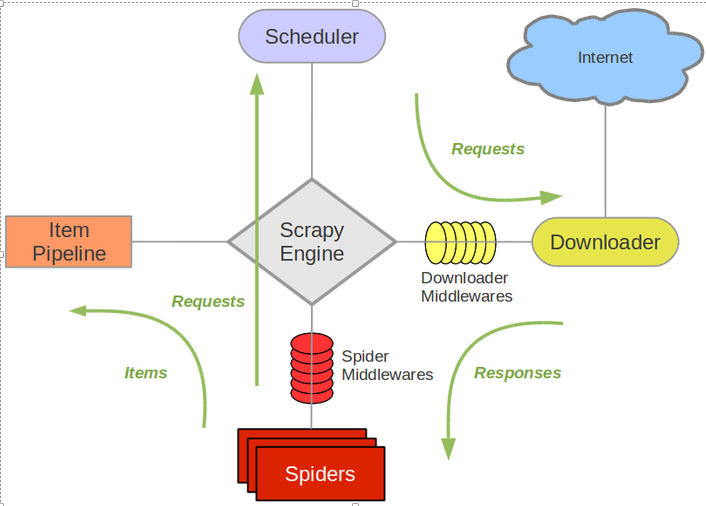
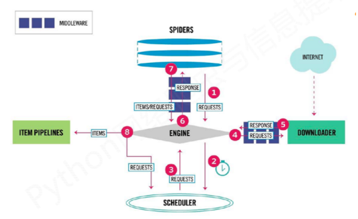
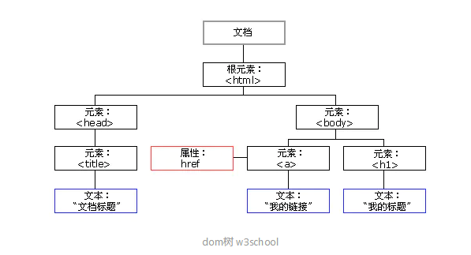

# scrapy 爬虫框架
个人简介：
wedo实验君, 数据分析师；热爱生活，热爱写作
## 1. scrapy简介
scrapy是基于事件驱动的Twisted框架下用纯python写的爬虫框架。很早之前就开始用scrapy来爬取网络上的图片和文本信息，一直没有把细节记录下来。这段时间，因为工作需要又重拾scrapy爬虫，本文和大家分享下，包你一用就会， 欢迎交流。
### 1.1 scrapy框架
scrapy框架包括5个主要的组件和2个中间件Hook。
- ENGIINE： 整个框架的控制中心， 控制整个爬虫的流程。根据不同的条件添加不同的事件（就是用的Twisted）
- SCHEDULER： 事件调度器
- DOWNLOADER：接收爬虫请求，从网上下载数据
- SPIDERS：发起爬虫请求，并解析`DOWNLOADER`返回的网页内容，同时和数据持久化进行交互,`需要开发者编写`
- ITEM PIPELINES：接收`SPIDERS`解析的结构化的字段，进行持久化等操作，`需要开发者编写`
- MIDDLEWARES： `ENGIINE`和`SPIDERS`, `ENGIINE`和`DOWNLOADER`之间一些额外的操作，hook的方式提供给开发者

从上可知，我们只要实现`SPIDERS`（要爬什么网站，怎么解析）和`ITEM PIPELINES`（如何处理解析后的内容）就可以了。其他的都是有框架帮你完成了。（图片来自网络，如果侵权联系必删）




### 1.2 scrapy数据流
我们再详细看下组件之间的数据流，会更清楚框架的内部运作。（图片来自网络，如果侵权联系必删）




- 1. `SPIDERS`发爬虫请求给`ENGIINE`， 告诉它任务来了
- 2. `ENGIINE`将请求添加到`SCHEDULER`调度队列里, 说任务就交给你了，给我安排好
- 3. `SCHEDULER`看看手里的爬取请求很多，挑一个给`ENGIINE`， 说大哥帮忙转发给下载`DOWNLOADER`
- 4. `ENGIINE`： 好的， `DOWNLOADER`你的任务来了
- 5. `DOWNLOADER`： 开始下载了，下载好了，任务结果 交给`ENGIINE`
- 6. `ENGIINE`将结果给`SPIDERS`， 你的一个请求下载好了，快去解析吧
- 7. `SPIDERS`： 好的，解析产生了结果字段。又给`SPIDERS`转发给`ITEM PIPELINES`
- 8. `ITEM PIPELINES`: 接收到字段内容，保存起来。

第1步到第8步，一个请求终于完成了。是不是觉得很多余？`ENGIINE`夹在中间当传话筒，能不能直接跳过？ 可以考虑跳过了会怎么样。

这里分析一下
- `SCHEDULER`的作用： 任务调度， 控制任务的并发，防止机器处理不过来
- `ENGIINE`： 就是基于`Twisted`框架, 当事件来（比如转发请求）的时候，通过回调的方式来执行对应的事件。我觉得`ENGIINE`让所有操作变的统一，都是按照事件的方式来组织其他组件， 其他组件以低耦合的方式运作； 对于一种框架来说，无疑是必备的。

## 2. 基础：XPath
写爬虫最重要的是解析网页的内容，这个部分就介绍下通过`XPath`来解析网页，提取内容。
### 2.1 HTML节点和属性
（图片来自网络，如果侵权联系必删）



### 2.2 解析语法
- a / b： ‘/’在 xpath里表示层级关系，左边的 a是父节点，右边的 b是子节点
- a // b： 表示a下所有b，直接或者间接的
- [@]：选择具有某个属性的节点
   - //div[@classs], //a[@x]：选择具有 class属性的 div节点、选择具有 x属性的 a节点
   -  //div[@class="container"]：选择具有 class属性的值为 container的 div节点
- //a[contains(@id, "abc")]：选择 id属性里有 abc的 a标签


**一个例子**
```python
response.xpath('//div[@class="taglist"]/ul//li//a//img/@data-original').get_all()
# 获取所有class属性（css）为taglist的div， 下一个层ul下的所有li下所有a下所有img标签下data-original属性

# data-original这里放的是图片的url地址
```

**更多详见**

> http://zvon.org/comp/r/tut-XPath_1.html#Pages~List_of_XPaths
## 3. 安装部署
Scrapy 是用纯python编写的，它依赖于几个关键的python包（以及其他包）：

- lxml 一个高效的XML和HTML解析器
- parsel ，一个写在lxml上面的html/xml数据提取库,
- w3lib ，用于处理URL和网页编码的多用途帮助程序
- twisted 异步网络框架
- cryptography 和 pyOpenSSL ，处理各种网络级安全需求
  
``` shell
# 安装
pip install scrapy
```

## 4. 创建爬虫项目

``` shell
scrapy startproject sexy

# 创建一个后的项目目录
# sexy
# │  scrapy.cfg
# │
# └─sexy
#     │  items.py
#     │  middlewares.py
#     │  pipelines.py
#     │  settings.py
#     │  __init__.py
#     │
#     ├─spiders
#     │  │  __init__.py
#     │  │
#     │  └─__pycache__
#     └─__pycache__

# 执行 需要到scrapy.cfg同级别的目录执行
scrapy crawl sexy
```

从上可知，我们要写的是`spiders`里的具体的spider类和`items.py和pipelines.py`（对应的`ITEM PIPELINES`）

## 5. 开始scrapy爬虫
### 5.1 简单而强大的spider
这里实现的功能是从图片网站中下载图片，保存在本地， url做了脱敏。需要注意的点在注释要标明
- 类要继承 `scrapy.Spider`
- 取一个唯一的name
- 爬取的网站url加到start_urls列表里
- 重写`parse`利用xpath解析reponse的内容

可以看到`parse`实现的时候没有转发给`ITEM PIPELINES`，直接处理了。这样简单的可以这么处理，如果业务很复杂，建议交给`ITEM PIPELINES`。 后面会给例子

```python
# 目录结果为：spiders/sexy_spider.py
import scrapy
import os
import requests
import time


def download_from_url(url):
    response = requests.get(url, stream=True)
    if response.status_code == requests.codes.ok:
        return response.content
    else:
        print('%s-%s' % (url, response.status_code))
        return None


class SexySpider(scrapy.Spider):
   # 如果有多个spider， name要唯一
    name = 'sexy'
    allowed_domains = ['uumdfdfnt.94demo.com']
    allowed_urls = ['http://uumdfdfnt.94demo.com/']

    # 需要爬取的网站url加到start_urls list里
    start_urls = ['http://uumdfdfnt.94demo.com/tag/dingziku/index.html']
    save_path = '/home/sexy/dingziku'

    def parse(self, response):
        # 解析网站，获取图片列表
        img_list = response.xpath('//div[@class="taglist"]/ul//li//a//img/@data-original').getall()
        time.sleep(1)

        # 处理图片， 具体业务操作， 可交给items， 见5.2 items例子
        for img_url in img_list:
            file_name = img_url.split('/')[-1]
            content = download_from_url(img_url)
            if content is not None:
                with open(os.path.join(self.save_path, file_name), 'wb') as fw:
                    fw.write(content)

        # 自动下一页（见5.3 自动下一页）
        next_page = response.xpath('//div[@class="page both"]/ul/a[text()="下一页"]/@href').get()
        if next_page is not None:
            next_page = response.urljoin(next_page)
            yield scrapy.Request(next_page, callback=self.parse)
```

### 5.2 items和pipline例子
这里说明下两个的作用
- items： 提供一个字段存储， spider会将数据存在这里
- pipline： 会从items取数据，进行业务操作，比如5.1中的保存图片；又比如存储到数据库中等

我们来改写下上面的例子

- **items.py**
其实就是定义字段`scrapy.Field()`
```python
import scrapy
class SexyItem(scrapy.Item):
    # define the fields for your item here like:
    # name = scrapy.Field()
    img_url = scrapy.Field()
```

- **spiders/sexy_spider.py**
```python
import scrapy
import os
# 导入item
from ..items import SexyItem

class SexySpider(scrapy.Spider):
   # 如果有多个spider， name要唯一
    name = 'sexy'
    allowed_domains = ['uumdfdfnt.94demo.com']
    allowed_urls = ['http://uumdfdfnt.94demo.com/']

    # 需要爬取的网站url加到start_urls list里
    start_urls = ['http://uumdfdfnt.94demo.com/tag/dingziku/index.html']
    save_path = '/home/sexy/dingziku'

    def parse(self, response):
        # 解析网站，获取图片列表
        img_list = response.xpath('//div[@class="taglist"]/ul//li//a//img/@data-original').getall()
        time.sleep(1)

        # 处理图片， 具体业务操作， 可交给yield items
        for img_url in img_list:
            items = SexyItem()
            items['img_url'] = img_url
            yield items
```

- **pipelines.py**
```python
import os
import requests


def download_from_url(url):
    response = requests.get(url, stream=True)
    if response.status_code == requests.codes.ok:
        return response.content
    else:
        print('%s-%s' % (url, response.status_code))
        return None


class SexyPipeline(object):

    def __init__(self):
        self.save_path = '/tmp'

    def process_item(self, item, spider):
        if spider.name == 'sexy':
            # 取出item里内容
            img_url = item['img_url']
            
            # 业务处理
            file_name = img_url.split('/')[-1]
            content = download_from_url(img_url)
            if content is not None:
                with open(os.path.join(self.save_path, file_name), 'wb') as fw:
                    fw.write(content)
        return item
```

- **重要的配置要开启**
在`settings.py`中开启piplines类，数值表示优先级
```python
ITEM_PIPELINES = {
   'sexy.pipelines.SexyPipeline': 300,
}
```

### 5.3 自动下一页
有时候我们不仅要爬取请求页面中的内容，还要递归式的爬取里面的超链接url，特别是下一页这种，解析内容和当前页面相同的情况下。一种笨方法是手动加到`start_urls`里。大家都是聪明人来试试这个。
- 先在页面解析下下一页的url
- scrapy.Request(next_page, callback=self.parse) 发起一个请求，并调用parse来解析，当然你可以用其他的解析

完美了，完整例子见`5.1`
```python
next_page = response.xpath('//div[@class="page both"]/ul/a[text()="下一页"]/@href').get()
if next_page is not None:
   next_page = response.urljoin(next_page)
   yield scrapy.Request(next_page, callback=self.parse)
```

### 5.4 中间件
- 下载中间件
中间件的作用是提供一些常用的钩子Hook来增加额外的操作。中间件的操作是在`middlewares.py`。可以看到主要是处理请求`process_request`，响应`process_response`和异常`process_exception`三个钩子函数。
- 处理请求`process_request`: 传给`DOWNLOADER`之前做的操作
- 响应`process_response`：`DOWNLOADER`给`ENGIINE`响应之前的操作

这里举一个添加模拟浏览器请求的方式，防止爬虫被封锁。重写`process_request`

```python
from scrapy.contrib.downloadermiddleware.useragent import UserAgentMiddleware
import random
agents = ['Mozilla/5.0 (compatible; MSIE 9.0; Windows NT 6.1; Trident/5.0;',
              'Mozilla/5.0 (Macintosh; Intel Mac OS X 10.6; rv,2.0.1) Gecko/20100101 Firefox/4.0.1',
              'Opera/9.80 (Macintosh; Intel Mac OS X 10.6.8; U; en) Presto/2.8.131 Version/11.11',
              'Mozilla/5.0 (Macintosh; Intel Mac OS X 10_7_0) AppleWebKit/535.11 (KHTML, like Gecko) Chrome/17.0.963.56 Safari/535.11',
              'Mozilla/4.0 (compatible; MSIE 7.0; Windows NT 5.1; 360SE)']

class RandomUserAgent(UserAgentMiddleware):
    def process_request(self, request, spider):
        ua = random.choice(agents)
        request.headers.setdefault('User-agent',ua,)
```

统一要在`settings.py`中开启下载中间件，数值表示优先级
```python
DOWNLOADER_MIDDLEWARES = {
    'sexy.middlewares.customUserAgent.RandomUserAgent': 20,
}
```

### 5.5 可用配置`settings.py`
除了上面提供的pipline配置开启和中间件配置外，下面介绍几个常用的配置
- 爬虫机器人规则： ROBOTSTXT_OBEY = False， 如果要爬取的网站有设置robots.txt，最好设置为False
- CONCURRENT_REQUESTS： 并发请求
- DOWNLOAD_DELAY： 下载延迟，可以适当配置，避免把网站也爬挂了。

所有的配置详见 `https://doc.scrapy.org/en/latest/topics/settings.html`

## 6. 总结
相信从上面的介绍，你已经可以动手写一个你自己的爬虫了。我也完成了做笔记的任务了。scrapy还提供更加详细的细节，可参见`https://docs.scrapy.org/en/latest/`。

最后总结如下：
- scrapy是基于事件驱动Twisted框架的爬虫框架。`ENGIINE`是核心，负责串起其他组件
- 开发只要编写spider和item pipline和中间件， download和schedule交给框架
- scrapy crawl 你的爬虫name，name要唯一
- 爬取的url放在start_urls， spider会自动Request的，parse来解析
- pipline和中间件要记得在settings中开启
- 关注下settings的常用配置，需要时看下文档
