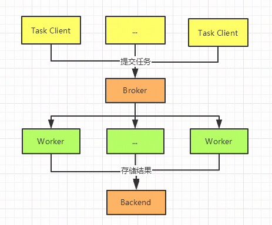
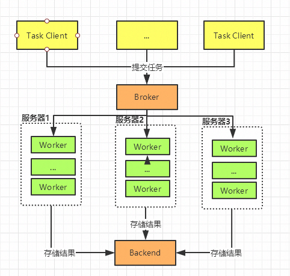

# 一文读懂python分布式任务队列-celery
个人简介：
wedo实验君, 数据分析师；热爱生活，热爱写作
## **1.什么是celery**
celery是一个简单，灵活、可靠的分布式任务执行框架，可以支持大量任务的并发执行。celery采用典型生产者和消费者模型。生产者提交任务到任务队列，众多消费者从任务队列中取任务执行。
### **1.1 celery架构**
Celery由以下三部分构成：消息中间件(Broker)、任务执行单元Worker、结果存储(Backend)



- 任务调用提交任务执行请求给Broker队列
- 如果是异步任务，worker会立即从队列中取出任务并执行，执行结果保存在Backend中
- 如果是定时任务，任务由Celery Beat进程周期性地将任务发往Broker队列，Worker实时监视消息队列获取队列中的任务执行

### **1.2 应用场景**
- 大量的长时间任务的异步执行， 如上传大文件
- 大规模实时任务执行，支持集群部署，如支持高并发的机器学习推理
- 定时任务执行，如定时发送邮件，定时扫描机器运行情况

## **2.安装**
celery安装非常简单, 除了安装celery，本文中使用redis作为消息队列即Broker

```bash
# celery 安装
pip install celery
# celery 监控 flower
pip install flower
pip install redis
```

```bash
# redis 安装
yum install redis
# redis启动
redis-server /etc/redis.conf
```

## **3. 完整例子**
celery的应用开发涉及四个部分
- celery 实例初始化
- 任务的定义（定时和实时任务）
- 任务worker的启动
- 任务的调用


### **3.1 项目目录**
```bash
# 项目目录
wedo
.
├── config.py
├── __init__.py
├── period_task.py
└── tasks.py
```
### **3.2 celery 实例初始化**
celery的实例化，主要包括执行Broker和backend的访问方式，任务模块的申明等
```python
# celery 实例初始化 
# __init__.py
from celery import Celery
app = Celery('wedo')  # 创建 Celery 实例
app.config_from_object('wedo.config') 

# 配置 wedo.config
# config.py
BROKER_URL = 'redis://10.8.238.2:6379/0' # Broker配置，使用Redis作为消息中间件
CELERY_RESULT_BACKEND = 'redis://10.8.238.2:6379/0' # BACKEND配置，这里使用redis
CELERY_RESULT_SERIALIZER = 'json' # 结果序列化方案
CELERY_TASK_RESULT_EXPIRES = 60 * 60 * 24 # 任务过期时间
CELERY_TIMEZONE='Asia/Shanghai'   # 时区配置
CELERY_IMPORTS = (     # 指定导入的任务模块,可以指定多个
    'wedo.tasks',
    'wedo.period_task'
)
```
### **3.3 任务的定义**
celery中通过@task的装饰器来进行申明celery任务，其他操作无任何差别
```python
# 任务的定义
# 简单任务  tasks.py
import celery
import time
from celery.utils.log import get_task_logger
from wedo import app

@app.task
def sum(x, y):
    return x + y

@app.task
def mul(x, y):
    time.sleep(5)
    return x * y
```

定时任务和实时任务的区别主要是要申明何时执行任务，任务本身也是通过task装饰器来申明
何时执行任务有2种
- 指定频率执行： sender.add_periodic_task(时间频率单位s, 任务函数, name='to_string') 
- crontab方式：分钟/小时/天/月/周粒度， 可以支持多种调度
```python
# 任务的定义
# 定时任务  period_task.py
from wedo import app
from celery.schedules import crontab

@app.on_after_configure.connect
def setup_periodic_tasks(sender, **kwargs):
    sender.add_periodic_task(5.0, to_string.s("celery peroid task"), name='to_string') # 每5秒执行add
    sender.add_periodic_task(
        crontab(minute='*/10'),      #每10分钟执行一次
        send_mail.s('hello, this is a celery'), name='send_mail'
    )

@app.task
def send_mail(content):
    print('send mail, content is %s' % content)

@app.task
def to_string(text):
    return 'this is a %s' % text
```

### **3.4 任务worker的启动**
任务启动分为worker启动和定时任务beat启动
```bash
# -A wedo为应用模块
# -l为日志level
# -c 为进程数
celery worker -A wedo  -l debug -c 4

# 后台启动
nohup celery worker -A wedo -l debug -c 4 > ./log.log  2>&1

# 从下面的日志可以看出启动了4个任务
#   . wedo.period_task.send_mail
#   . wedo.period_task.to_string
#   . wedo.tasks.mul
#   . wedo.tasks.sum

 -------------- celery@localhost.localdomain v4.4.2 (cliffs)
--- ***** ----- 
-- ******* ---- Linux-3.10.0-327.28.3.el7.x86_64-x86_64-with-centos-7.2.1511-Core 2020-04-25 23:35:26
- *** --- * --- 
- ** ---------- [config]
- ** ---------- .> app:         wedo:0x7f05af30d320
- ** ---------- .> transport:   redis://10.8.238.2:6379/0
- ** ---------- .> results:     redis://10.8.238.2:6379/0
- *** --- * --- .> concurrency: 4 (prefork)
-- ******* ---- .> task events: OFF (enable -E to monitor tasks in this worker)
--- ***** ----- 
 -------------- [queues]
                .> celery           exchange=celery(direct) key=celery
                

[tasks]
  . celery.accumulate
  . celery.backend_cleanup
...
  . wedo.period_task.send_mail
  . wedo.period_task.to_string
  . wedo.tasks.mul
  . wedo.tasks.sum
...
[2020-04-25 23:35:27,617: INFO/MainProcess] celery@localhost.localdomain ready.
[2020-04-25 23:35:27,617: DEBUG/MainProcess] basic.qos: prefetch_count->16
[2020-04-25 23:35:27,655: DEBUG/MainProcess] celery@12103675 joined the party

```
```bash
celery beat -A wedo.period_task

celery beat v4.4.2 (cliffs) is starting.
__    -    ... __   -        _
LocalTime -> 2020-04-25 23:37:08
Configuration ->
    . broker -> redis://10.8.238.2:6379/0
    . loader -> celery.loaders.app.AppLoader
    . scheduler -> celery.beat.PersistentScheduler
    . db -> celerybeat-schedule
    . logfile -> [stderr]@%WARNING
    . maxinterval -> 5.00 minutes (300s)
```

```bash
# worker启动是4个进程
\_  /root/anaconda3/envs/post/bin/celery worker -A wedo -l debug -c 4    
    \_  /root/anaconda3/envs/post/bin/celery worker -A wedo -l debug -c 4
    \_  /root/anaconda3/envs/post/bin/celery worker -A wedo -l debug -c 4
    \_  /root/anaconda3/envs/post/bin/celery worker -A wedo -l debug -c 4
    \_  /root/anaconda3/envs/post/bin/celery worker -A wedo -l debug -c 4
```

**worker和beat的停止**
```bash
ps auxww | awk '/celery worker/ {print $2}' | xargs kill -9
ps auxww | awk '/celery beat/ {print $2}' | xargs kill -9
```

### **3.5 任务的调用**
任务worker已经启动好了，通过任务调用传递给broker（redis），并返回任务执行结果
任务调用主要有两种，本质是一致的，delay是apply_async的封装，apply_async可以支持更多的任务调用配置
- task.apply_async(args=[arg1, arg2], kwargs={'kwarg1': 'x', 'kwarg2': 'y'})
- task.delay(arg1, arg2, kwarg1='x', kwarg2='y')


apply_async和delay会返回一个异步的任务结果<AsyncResult>，AsyncResult中存储了任务的执行状态和结果，常用的操作
``` python
value = result.get() # 任务返回值
print(result.__dict__) # 结果信息
print(result.successful()) # 是否成功
print(result.fail()) # 是否失败
print(result.ready()) # 是否执行完成
print(result.state) # 状态 PENDING -> STARTED -> SUCCESS/FAIL
``` 

**常规任务**:
``` python
from celery.utils.log import get_logger
from wedo.tasks import sum, mul, post_file
from celery import group, chain, chord
logger = get_logger(__name__)
try:
    result = mul.apply_async(args=(2, 2))
    value = result.get() # 等待任务执行完毕后，才会返回任务返回值
    print(value)
except mul.OperationalError as exc: # 任务异常处理
    logger.exception('Sending task raised: %r', exc)
```

**组合任务**: 
- 多个任务并行执行, group
- 多个任务链式执行，chain：第一个任务的返回值作为第二个的输入参数，以此类推
``` python
result = group(sum.s(i, i) for i in range(5))()
result.get()
# [0, 2, 4, 6, 8]
result = chain(sum.s(1,2), sum.s(3), mul.s(3))()
result.get()
# ((1+2)+3)*3=18
```

## **4. 分布式集群部署**
celery作为分布式的任务队列框架，worker是可以执行在不同的服务器上的。部署过程和单机上启动是一样。只要把项目代码copy到其他服务器，使用相同命令就可以了。可以思考下，这个是怎么实现的？
对了，就是通过共享`Broker队列`。使用合适的队列，如redis，单进程单线程的方式可以有效的避免同个任务被不同worker同时执行的情况。
``` bash
celery worker -A wedo  -l debug -c 4
```
- 分布式集群如下：




## **5. 进阶使用**
在前面已经了解了celery的主要的功能了。celery还为一些特别的场景提供了需要扩展的功能

### 5.1 任务状态跟踪和日志
有时候我们需要对任务的执行情况做一些监控，比如失败后报警通知。
- celery在装饰器@app.task中提供了base参数，传入重写的Task模块，重新on_*函数就可以控制不同的任务结果
- 在@app.task提供bind=True，可以通过self获取Task中各种参数
   - self.request： 任务的各种参数
   - self.update_state: 自定义任务状态, 原有的任务状态：PENDING -> STARTED -> SUCCESS， 如果你想了解STARTED -> SUCCESS之间的一个状态，比如执行的百分比之类，可以通过自定义状态来实现
   - self.retry: 重试
```python
import celery
import time
from celery.utils.log import get_task_logger
from wedo import app

logger = logger = get_task_logger(__name__)
class TaskMonitor(celery.Task):
    def on_failure(self, exc, task_id, args, kwargs, einfo):
        """failed callback"""
        logger.info('task id: {0!r} failed: {1!r}'.format(task_id, exc))

    def on_success(self, retval, task_id, args, kwargs):
        """success callback"""
        logger.info('task id:{} , arg:{} , successful !'.format(task_id,args))

    def on_retry(self, exc, task_id, args, kwargs, einfo):
        """retry callback"""
        logger.info('task id:{} , arg:{} , retry !  einfo: {}'.format(task_id, args, exc))

@app.task(base=TaskMonitor, bind=True, name='post_file')
def post_file(self, file_names):
    logger.info(self.request.__dict__)
    try:
        for i, file in enumerate(file_names):
            print('the file %s is posted' % file)
            if not self.request.called_directly:
                self.update_state(state='PROGRESS',
                    meta={'current': i, 'total': len(file_names)})
            time.sleep(2)
    except Exception as exec:
        raise self.retry(exc=exec, countdown=3, max_retries=5)
```

### 5.2 任务指定特定的worker执行
celery做为支持分布式，理论上可以无限扩展worker。默认情况下celery提交任务后，任务会放入名为celery的队列，所有在线的worker都会从任务队列中获取任务，任一个worker都有可能执行这个任务。有时候，有时候任务的特殊性或者机器本身的限制，某些任务只能跑在某些worker上。celery提供了queue在区别不同的worker，很好的支持这种情况。

- 启动worker时，-Q 指定worker支持的任务列队名, 可以支持多个队列名哦
```bash
celery worker -A wedo  -l debug -c 4 -Q celery,hipri
```
- 任务调用时， `queue=*`来指定需要执行worker
```python
result = mul.apply_async(args=(2, 2), queue='hipri')
```

## **6. 任务队列监控**
如果你想通过可视化的方式，查看celery的一切。flower提供可行的解决方案，十分的方便

```bash
flower -A wedo --port=6006
# web访问 http://10.8.238.2:6006/
```


## **7. 总结**
本文和大家了介绍了分布式的队列celery， 妥妥的很全吧， 欢迎交流。总结下内容：
- celery为分布式队列， 通过消息队列连接任务提交和执行者worker， 松耦合模式，可扩展
- celery消息队列建议为redis
- celery通过@app.task装饰把普通任务变成celery Task
- celery worker 通过不同queue支持特定的worker消费特定的任务
- @app.task中可以同步base和bind参数获取更过的控制任务生命周期
- flower监控celery全过程
- celery doc： https://docs.celeryproject.org/en/master/getting-started/index.html
