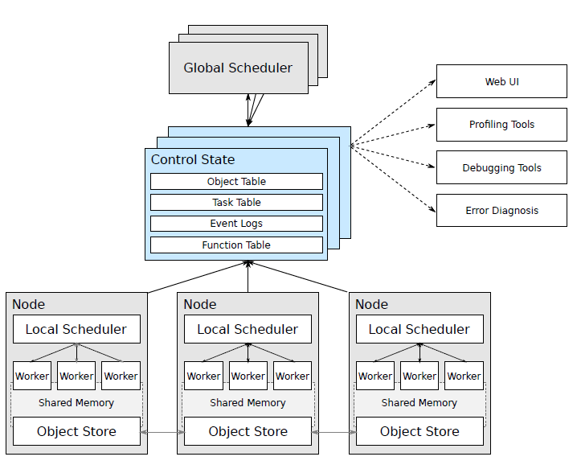

# 机器学习分布式框架Ray
## 1.什么是Ray
分布式计算框架大家一定都耳熟能详，诸如离线计算的Hadoop（map-reduce），spark， 流式计算的strom,Flink等。相对而言，这些计算框架都依赖于其他大数据组件，安装部署也相对复杂。

在python中，之前有分享过的Celery可以提供分布式的计算。今天和大家分享另外一个开源的分布式计算框架Ray。Ray是UC Berkeley RISELab新推出的高性能分布式执行框架，具有比Spark更优异的计算性能，而且部署和改造更简单，同时支持机器学习和深度学习的分布式训练，支持主流的深度学习框架（pytorch，tensorflow，keras等）


- https://github.com/ray-project/ray


## 2. Ray架构
Ray的架构参见最早发布的论文`Ray: A Distributed Framework for Emerging AI Applications`



由上图可以Ray主要包括：
- Node: 节点，主要是head和worker， head可以认为是Master，worker是执行任务的单元
  - 每个节点都有自己的本地调度器local scheduler
  - object store：一个内存对象存储，允许Node之间进行通信
- scheduler： 有两个调度器，每个节点都有本地的调度器， 在提交任务时，Local Scheduler会判断是否需要提交给Global Scheduler分发给其他worker来执行。
- GCS：全局状态控制记录了Ray中各种对象的状态信息，可以认为是meta数据，是Ray容错的保证

Ray适用于任何分布式计算的任务，包括分布式训练。笔者最近是用在大量的时间序列预测模型训练和在线预测上。

Ray目前库支持超参数调优Ray tune， 梯度下降Ray SGD，推理服务RaySERVE, 分布式数据Dataset以及分布式增强学习RLlib。还有其他第三方库，如下所示：


## 3. 简单使用
### 3.1 安装部署
``` shell
pip install --upgrade pip
# pip install ray
pip install ray == 1.6.0

# ImportError: cannot import name 'deep_mapping' from 'attr.validators'
# pip install attr == 19.1.0
```

### 3.2 单机使用
- 简单例子
    Ray 通过@ray.remote装饰器使得函数变成可分布式调用的任务。通过函数名.remote方式进行提交任务，通过ray.get方式来获取任务返回值。单击情况下和多线程异步执行的方式类似。
    ``` python
    import time
    import ray
    ray.init(num_cpus = 4) # Specify this system has 4 CPUs.

    @ray.remote
    def do_some_work(x):
        time.sleep(1) # Replace this is with work you need to do.
        return x

    start = time.time()
    results = ray.get([do_some_work.remote(x) for x in range(4)])
    print("duration =", time.time() - start)
    print("results = ", results)

    # duration = 1.0107324123382568
    # results =  [0, 1, 2, 3]

    ```
    remote返回的对象的id 如ObjectRef(7f10737098927148ffffffff0100000001000000)。需要通过ray.get来获取实际的值， 需要注意的是ray.get是阻塞式的调用，不能[ray.get(do_some_work.remote(x)） for x in range(4)]

- 注意小任务使用情况
    需要注意的是ray分布式计算在调度的时候需要发费额外的时间，如调度，进程间通信以及任务状态的更新等等，所以避免过小的任务。可以把小任务进行合并

    ``` python
    @ray.remote
    def tiny_work(x):
        time.sleep(0.0001) # Replace this is with work you need to do.
        return x

    start = time.time()
    result_ids = [tiny_work.remote(x) for x in range(100000)]
    results = ray.get(result_ids)
    print("duration =", time.time() - start)
    ```

- ray.put
    ray.put() 把一个对象放到对象存储上，返回一个object id， 这个id可以在分布式机器上都可以调用，该操作为异步的。通过ray.get()可以是获取。
    ```python
    num = ray.put(10)
    ray.get(num)
    ```
- ray.wait
    如果任务返回多个结果，ray.get()会等所有结果都完成之后才会执行后续的操作。如果多个结果执行的耗时不同，此时短板在于最长的那个任务。

    这个时候可以采用ray.wait()方法，ray.wait()返回执行完毕的和未执行完毕的任务结果，执行完成的结果可以继续后续的操作

    ``` python
    import random
    @ray.remote
    def do_some_work(x):
        time.sleep(random.uniform(0, 4)) # Replace this is with work you need to do.
        return x

    def process_incremental(sum, result):
        time.sleep(1) # Replace this with some processing code.
        return sum + result

    start = time.time()
    result_ids = [do_some_work.remote(x) for x in range(4)]
    sum = 0
    while len(result_ids):
        done_id, result_ids = ray.wait(result_ids)
        sum = process_incremental(sum, ray.get(done_id[0]))
    print("duration =", time.time() - start, "\nresult = ", sum)

    # duration = 5.270821809768677 
    # result =  6
    ```
    

### 2.3 集群部署

Ray的架构遵循master-slave的模式。Head Node 可以认为是Master，其他的Node为worker。在集群部署时，Head Node需要首先启动`ray start --head`, 其他机器依次启动worker,注意需要指定head Node的地址确定关系，`ray start --address 10.8.xx.3:6379`。

关闭服务，需要每一台机器执行 `ray.stop`


``` shell
# To start a head node.
#ray start --head --num-cpus=<NUM_CPUS> --num-gpus=<NUM_GPUS>
ray start --head --node-ip-address 10.8.xx.3 --port=6379


# To start a non-head node.
# ray start --address=<address> --num-cpus=<NUM_CPUS> --num-gpus=<NUM_GPUS>
ray start --address 10.8.xx.3:6379 --node-ip-address 10.8.xx.3 --num-cpus 10 --temp-dir={your temp path}

```


- 提交任务
    任何一台worker机器都可以提交任务， 先通过init连接Head Node就可以remote起来了。
    ``` python
    import ray
    ray.init(10.8.xx.3:6379)
    ```


## 3. 不同任务的例子
- 任务依赖
    任务之间存在依赖关系，Ray和Spark一样也是通过生成DAG图的方式来确定依赖关系，确定可以并行跑的任务。如下图所示zeros是可以并行跑的。

    

    ``` python
    import numpy as np
    # Define two remote functions. Invocations of these functions create tasks
    # that are executed remotely.

    @ray.remote
    def multiply(x, y):
        return np.dot(x, y)

    @ray.remote
    def zeros(size):
        return np.zeros(size)

    # Start two tasks in parallel. These immediately return futures and the
    # tasks are executed in the background.
    x_id = zeros.remote((100, 100))
    y_id = zeros.remote((100, 100))

    # Start a third task. This will not be scheduled until the first two
    # tasks have completed.
    z_id = multiply.remote(x_id, y_id)

    # Get the result. This will block until the third task completes.
    z = ray.get(z_id)
    print(z)
    ```
- 有状态任务
    上面提到的任务都是无状态的(除依赖外)，即任务之间都是无关系的。Ray也是支持有状态的任务成为Actor。常是在python class上加@ray.remote，ray会跟踪每个class内部状态的不同状态。
    ``` python
    @ray.remote
    class Counter(object):
        def __init__(self):
            self.n = 0

        def increment(self):
            self.n += 1

        def read(self):
            return self.n

    counters = [Counter.remote() for i in range(4)]

    # 不断的执行可以每个counter计数不断增加
    [c.increment.remote() for c in counters]
    futures = [c.read.remote() for c in counters]
    print(ray.get(futures))
    # [1, 1, 1, 1]
    # [11, 11, 11, 11]
    ```

- map-reduce 任务
    map-reduce任务其实可以其他分布式任务是一样的。主要是各种聚合操作。Map-Reduce常规操作如下
    

      - word count例子见：https://github.com/ray-project/ray/blob/master/doc/examples/streaming/streaming.py

    这里举一个简单的例子：
    ``` python
    @ray.remote
    def map(obj, f):
        return f(obj)
    @ray.remote
    def sum_results(*elements):
        return np.sum(elements)

    items = list(range(100))
    map_func = lambda i : i*2
    remote_elements = [map.remote(i, map_func) for i in items]

    # simple reduce
    remote_final_sum = sum_results.remote(*remote_elements)
    result = ray.get(remote_final_sum)

    # tree reduce
    intermediate_results = [sum_results.remote(
        *remote_elements[i * 20: (i + 1) * 20]) for i in range(5)]
    remote_final_sum = sum_results.remote(*intermediate_results)
    result = ray.get(remote_final_sum)

    ```
    
    
- 训练模型如pytorch
    官网提供了`Best Practices: Ray with PyTorch`, 主要是下载训练/测试数据和训练多个模型（感觉不是很实用）。训练多个模型，可以进行参数融合。
    
    参见 `https://docs.ray.io/en/latest/using-ray-with-pytorch.html`

## 4. 总结
本文分享了高效的Python分布式计算框架Ray，希望对你有帮助。总结如下：
- Ray是UC Berkeley RISELab新推出的高性能分布式执行框架， Spark也是伯克利出品的
- Ray架构关键：两个调度器， Head和worker节点，GCS全局状态控制保证计算容错
- Ray应用简单：@ray.remote把任务变成分布式任务， x.remote提交任务， get/wait获取结果
- 集群不是：ray start
- Ray支持多种任务：有依赖DAG，有状态Actor以及深度学习支持
- 不断丰富的库：RaySERVE， RaySGD， RayTune， Ray data，rllib

