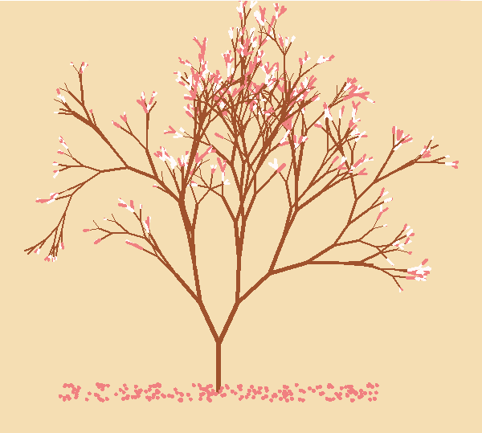
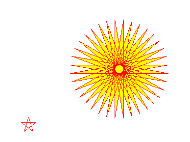
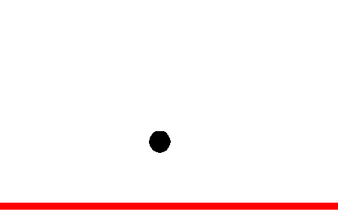

# 绘制你的图像-turtle

## 1. 什么是turtle
turtle又称为海龟绘图，是Wally Feurzeig, Seymour Papert 和 Cynthia Solomon 于 1967 年所创造的 Logo 编程语言的python实现。turtle是基于tkinter图形界面设计的。

turtle模拟了人在画布前画画的过程：给你一支笔（Pen）， 下笔（pendown），移动画笔绘制你的图形，然后填色等等。turtle提供了几种简单的命令，通过组合他们的顺序，只要够耐心，turtle可以画出令人惊叹的作品，很适合用来引导小朋友学习编程。

先来感受下作品：



## 2. turtle例子
我们通过一个简单的例子来了解turtle的基本操作
``` python
import turtle

# screen 画布属性设置
canvas = turtle.Screen()
canvas.bgcolor("white")

# 画笔设置
pen = turtle.Pen()
pen.hideturtle()
pen.color('red', 'yellow')

# 开始画第一个部分，并填充颜色
pen.begin_fill()
while True:
    pen.forward(200)
    pen.left(170)
    if abs(pen.pos()) < 1:
        break
pen.end_fill()

# 提笔， 移动位置，画第二个部分
pen.penup()
pen.goto(-100, -100)
pen.pendown()

for i in range(5):
    pen.forward(30) #长度300像素
    pen.right(144) #转角144度

turtle.done()

```


从上面可知turtle有两个部分组成画笔`Turtle` 和 画布`Screen`, `Turtle`在`Screen`上移动来作画。

需要注意的是，turtle起始的位置是(0, 0),位于画布中心，左边和下边的坐标为负值。

画笔`Turtle`重要操作：
- 画笔申明：如果画笔上有很多画笔需要 申明 turtle.Pen()，否则 默认是一个画笔，无需申明，如`turtle.forward(50)`就是表示画笔向前移动50
- 画笔颜色：color('red', 'yellow')， 第一个red表示画笔颜色， yellow表示填充颜色
- 填充的范围：begin_fill()和end_fill()之间的部分
- 画笔的移动：forward是向前多少距离，left是向左角度， 与之对应的是向后backward 和向右right。goto()是移动到某个坐标值
- 画笔的当前属性：如位置pos()即海龟当前的坐标 (x,y) ，还有如朝向角度值：heading()
- 画笔的控制：penup和pendown，默认画笔是在pendown状态下，只要有移动就会在画布上画出图形，如果需要调整位置，在另外一个位置下笔，需要先penup，否则移动画笔时也会有线条出来。这个和现实中画画是一样的。
- 画笔的可见性：正常情况下画笔时一个箭头的形状，可以通过hideturtle()和showturtle()隐藏和显示画笔

`Screen`重要操作：
- 设置背景颜色： bgcolor("white")

## 3. 其他turtle功能
除了上面例子中涉及到turtle常用功能函数，还有一些重要的功能。

- 圆形circle()
   前面的例子给出的是直线的例子（直线可以构成三角形，多边形等），另外一个重要的图形是圆形
   `turtle.circle(radius, extent=None, steps=None)`
   - radius:半径， radius 为正值则朝逆时针方向绘制圆弧，否则朝顺时针方向
   - extent： 表示是否画部分的圆，如半圆是180，默认是一整个圆
   - steps：是表示画圆用多少个多边形来画。圆其实是无穷多个多边形来近似得到。不过一般情况下，一定程度的多边形，肉眼就会人为圆的幅度是光滑的

    我们来看一个太极的例子：
    ``` python
    import turtle
    from turtle import *  #从turtle中导出所有模块
    radius = 100     #半径为100
    color("black", "black")  #画线颜色黑色，填充颜色黑色
    begin_fill()  #开始填充
    circle(radius/2, 180)  #逆时针画圈，半径为50,180°
    circle(radius, 180)  #逆时针画圈，半径为100,180°
    left(180)  #转向180°
    circle(-radius/2, 180)  #顺时针画圈，半径50,180°
    end_fill()  #填充结束
    #移动到画太极图黑色的小圈位置，开始画小白圈
    left(90)#左转向90°，海龟头垂直水平线向上
    penup()#提笔，不留痕迹
    forward(radius*0.35)#向前，半径的0.35=35像素
    right(90)#右转向90°，海龟头与右侧水平线同向
    pendown()#落笔，开始画线
    #开始画太极图黑色部分的小白圈
    color("white", "white")#画线颜色为白色，填充颜色为白色
    begin_fill()#开始填充
    circle(radius*0.15)#逆时针画圈，半径的0.15=15像素（35+15+15+35=100）
    end_fill() #填充结束

    left(90)#左转向90°
    penup()#提笔，不留痕迹
    backward(radius*0.7)#后退往下走，为半径的0.7=70，此时海龟头朝上与水平垂直
    pendown()#落笔，开始留下痕迹
    left(90)#左转90°，此时海龟头与左侧水平同向
    #开始画太极图白色部分里的小黑圈
    color("black", "black")#画线颜色为黑色，填充为黑色
    begin_fill()#开始填充
    circle(radius*0.15)#开始逆时针画圈，半径的0.15=15个像素
    end_fill() #填充完毕

    right(90)#再右转90°，此时海龟头垂直水平线向上
    penup()#提笔，不留痕迹
    backward(radius*0.65)#后退为半径的0.65=65个像素，往下到达太极图黑色半圈的底点处
    right(90)#右转90°，海龟头与右侧水平线同向
    pendown()#落笔，开始留下痕迹
    circle(radius, 180)#逆时针画圈，半径100,180°，画太极图的白色部分的大圈
    hideturtle()#隐藏笔头hideturtle
    turtle.done()
    ```
    

    可以看出太极图有2个小半圆和2个大半圆，以及2个更小的整圆构成。

- 动画控制
  turtle绘制图像的过程其实是动态的，每绘制一个部分画面可以理解为一个视频帧，画完视频就结束。所以turtle除了可以绘制图形，还可以用来做动画演示或者交互游戏也是可以。
  下面以一个例子说明下:
  ``` python
    import turtle, time
    # 初始不更新画面
    turtle.tracer(0)

    # 地板墙
    wall = turtle.Pen()
    wall.pencolor('red')
    wall.pensize(10)
    wall.hideturtle()
    wall.penup()
    wall.goto(-300, -200)
    wall.pendown()
    wall.forward(600)

    # 小球
    R = 15
    ball = turtle.Turtle('circle')
    ball.shapesize(R / 10)
    ball.penup()
    pos_x, pos_y = [100, 100]
    pos_x, pos_y = ball.pos()
    ball.goto(pos_x, pos_y)
    wall_x, wall_y = wall.pos()

    # 球参数
    FPS = 60  # 每秒60帧
    G = 0.03  # 模拟重力加速度
    DRAG = 0.9956 # 阻力
    v_y = 1 # 初始速度

    while True:

        # 清除印章
        ball.clearstamps()

        v_y += G  # 模拟重力加速度
        if pos_y - R - 10 < wall_y:  # 撞地面
            v_y *= -1

        pos_x, pos_y = pos_x, pos_y - v_y
        ball.goto(pos_x, pos_y)
        v_y = v_y * DRAG

        # 通过印章显示球
        ball.stamp()

        # 更新画面信息
        turtle.update()
        time.sleep(1 / FPS)
  ```
  

## 4. 更多的例子
- 玫瑰曲线
    ``` python
    from turtle import *
    from math import *
    color("red")
    def draw(a,end):
        t=0
        while t<(14*end):
            x=a*sin(t*3.14)*cos(t)
            y=a*sin(t*3.14)*sin(t)
            goto(x,y)
            t=t+0.03

    draw(100,3.14)
    done()
    ```
    

- 螺旋
    ``` python
    import turtle
    t=turtle.Pen()
    for x in range(360):
        t.forward(x)
        t.left(59)

    done()
    ```
    

- 扇子
    ``` python
    from turtle import *
    forward(200)
    left(90)
    fillcolor('red')
    begin_fill()
    circle(100,180)
    end_fill()
    left(90)
    forward(100)
    for i in range(17):
        left(10)
        pencolor('yellow')
        forward(100)
        backward(100)
    left(100)
    pensize(10)
    pencolor('red')
    forward(100)
    hideturtle()
    done()
    ```
    
## 5. 总结
本文分享了python的logo语言turtle库，可以绘制图画和动画。总结如下：
- turtle两个重要元素： 画布Screen和画笔Turtle
- 默认当前为一个画笔，turtle.Pen()申明多个画笔
- 画笔属性：颜色color， 大小pensize，位置pos
- 画笔填充:begin_fill()和end_fill()
- 画笔移动：前后forward和backward， 角度left和right
- 圆形画笔：circle
- 画笔控制：penup 和pendown
- 动画控制：update和trace追踪

## 6. 参考资料
- https://docs.python.org/zh-cn/3/library/turtle.html#